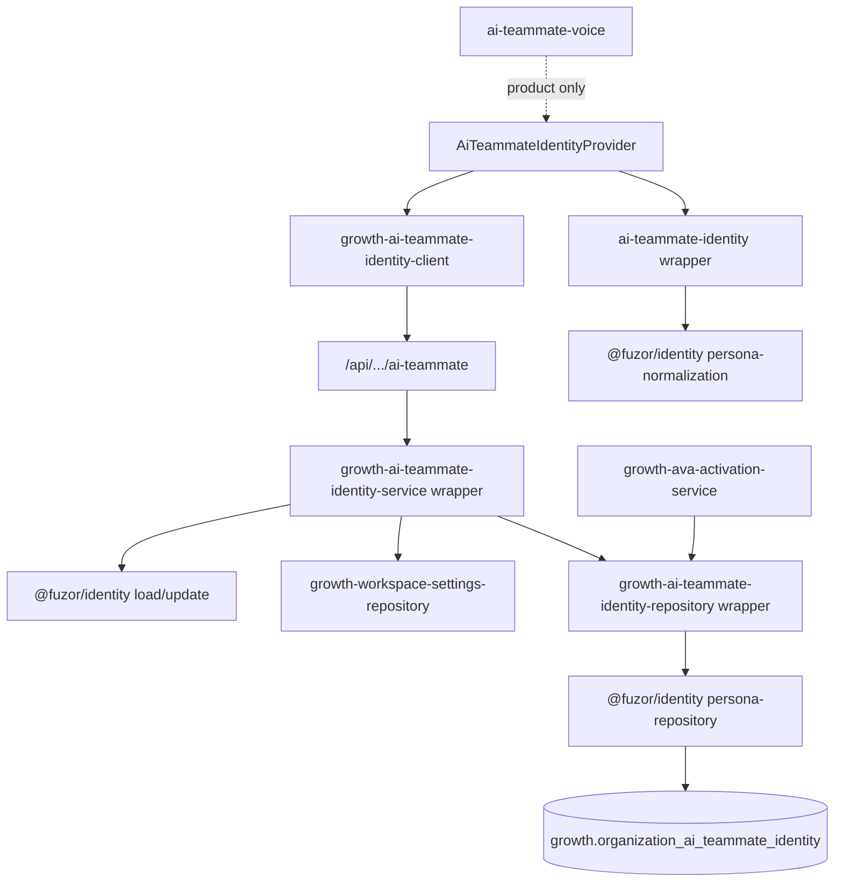

# FUZOR-ADOPTION-1F — Persona Repository Delegation

**Milestone ID:** FUZOR-ADOPTION-1F  
**Status:** Complete (local adoption)  
**Effective:** 2026-07-22  
**Platform prerequisite:** Certified for Multi-Tenant Platform Operation (Hardening 1A)  
**Scope:** Delegate GE-AI-UX-3A/3B persona repository into `@fuzor/identity`

---

## Executive summary

| Item | Result |
|------|--------|
| Persona persistence authority | `@fuzor/identity` |
| Equipify role | Compatibility consumer (thin wrappers) |
| Import paths | Unchanged |
| Tenant enforcement | Explicit `organizationId`; fail-closed |
| Schema / migrations | Unchanged — Equipify-owned |
| Production validation | **Not performed** — separate milestone |

**Constitutional split:** Platform answers *who is this persona?* Products answer *how does this persona behave?*

**Lifecycle:** **Extracted** · **Adopted** · **Validated (local)** — not Production Validated

---

## Phase 1 — Persona audit

### Equipify file classification

| File | Classification |
|------|----------------|
| `lib/growth/settings/growth-ai-teammate-identity-repository.ts` | **Compatibility wrapper** → `@fuzor/identity` |
| `lib/growth/settings/growth-ai-teammate-identity-service.ts` | **Compatibility wrapper** → `@fuzor/identity` + product onboarding adapter |
| `lib/growth/settings/growth-ai-teammate-identity-types.ts` | **Compatibility wrapper** (types) + product API path |
| `lib/workspace/ai-teammate-identity.ts` | **Compatibility wrapper** (presentation) + legacy bootstrap |
| `lib/growth/settings/growth-ai-teammate-identity-client.ts` | **Product** — HTTP client |
| `app/api/growth/workspace/settings/ai-teammate/route.ts` | **Product** — auth + HTTP |
| `components/growth/ai-teammate/*` | **UI** |
| `lib/workspace/ai-teammate-voice.ts` | **Product behavior** — copy |
| `lib/growth/workspace/growth-workspace-ava-identity.ts` | **Product behavior** — operator UX |
| `lib/growth/ava-activation/*` | **Product behavior** — activation workflows |
| `lib/growth/settings/growth-workspace-settings-repository.ts` | **Product persistence** — onboarding prefs |
| `lib/growth/settings/growth-workspace-settings-column-compat.ts` | **Configuration** — schema probes (unused by repo after 1F) |
| `supabase/migrations/*ai_teammate*` | **Persistence schema** — Equipify-owned |

### Fuzor canonical modules

| Module | Classification |
|--------|----------------|
| `persona-repository.ts` | **Canonical repository** |
| `persona-identity-service.ts` | **Canonical service** |
| `persona-normalization.ts` | **Identity + presentation substrate** |
| `persona-types.ts` | **Metadata / types** |
| `persona-persistence-contract.ts` | **Persistence contract** |

### Dependency graph

---

## Phase 2 — Ownership classification

### Fuzor owns

- Repository CRUD and lookup
- Persona identity record shape and QA markers
- Name normalization / validation
- Organization-scoped persistence queries
- Server load/update orchestration (with injectable onboarding port)
- Org-scoped browser storage keys (platform substrate)

### Equipify owns

- Ava prompts and sales/outreach copy
- Growth Engine workflows using persona *presentation*
- DataMoon and campaign logic
- Operator UX and React components
- HTTP authentication and workspace access
- Onboarding preference writes (`operator_workspace_preferences`)
- Autonomous activation orchestration
- Database migrations and RLS

---

## Phase 3 — Repository delegation

| Equipify export | Platform export |
|-----------------|-----------------|
| `getOrganizationAiTeammateIdentity` | `getPlatformOrganizationPersonaRecord` |
| `upsertOrganizationAiTeammateIdentity` | `upsertPlatformOrganizationPersonaRecord` |
| `getAiTeammateOnboardingCompletedForUser` | `getPlatformPersonaOnboardingCompletedForUser` |
| `getOrganizationAiTeammateAutonomousActivation` | `getPlatformOrganizationPersonaAutonomousActivation` |
| `setOrganizationAiTeammateAutonomousActivation` | `setPlatformOrganizationPersonaAutonomousActivation` |
| `loadAiTeammateIdentity` | `loadPlatformPersonaIdentity` |
| `updateAiTeammateIdentity` | `updatePlatformPersonaIdentity` (+ Equipify onboarding adapter) |

No embedded Supabase logic remains in Equipify repository wrapper.

---

## Phase 4 — Tenant validation

| Requirement | Evidence |
|-------------|----------|
| Explicit `organizationId` on repository | All Fuzor repo methods require org string |
| Fail closed | Missing org on name save throws; wrong org returns default/null |
| No tenant inference | Multitenancy Hardening 1A — no platform defaults |
| Multitenancy regression | `persona-identity-service.test.ts` org A/B isolation |

---

## Phase 5 — Behavioral parity

| Dimension | Status |
|-----------|--------|
| Record IDs / UUID keys | Unchanged (`organization_id` PK) |
| QA markers | Unchanged |
| Timestamps | Unchanged |
| Serialization | Unchanged |
| Error messages | Unchanged (extracted verbatim) |
| Default name "Ava" | Unchanged |
| Role presentation string | Unchanged (historical parity constant) |
| API response shape | Unchanged |

---

## Phase 6 — Compatibility layer

Stable Equipify paths preserved:

- `@/lib/workspace/ai-teammate-identity`
- `@/lib/growth/settings/growth-ai-teammate-identity-repository`
- `@/lib/growth/settings/growth-ai-teammate-identity-service`
- `@/lib/growth/settings/growth-ai-teammate-identity-types`

Wrappers delegate only; no platform types leak to ~120 callers.

---

## Phase 7 — Regression

| Command | Result |
|---------|--------|
| `npm test --workspace=@fuzor/identity` | 33 passed |
| `pnpm test:fuzor-adoption-1f-persona-repository-parity` | PASS |
| `pnpm test:fuzor-adoption-1b-identity-actor-catalog` | PASS |
| `pnpm test:ge-ai-ux-3a-ai-teammate-identity-foundation` | PASS |
| `pnpm test:ge-ai-ux-3b-ai-teammate-server-identity` | PASS |

Package: `vendor/fuzor-packages/fuzor-identity-0.1.0.tgz` (repacked post-hardening).

---

## Phase 8 — Future persona model

The platform stores **organization-scoped persona identity** only. Product name (Ava, Ivy, Orion) is data, not code coupling.

| Product | Example persona | Organization scope | Platform API |
|---------|-----------------|-------------------|--------------|
| Equipify | Ava | `org-equipify-*` | `getPlatformOrganizationPersonaRecord(admin, orgId)` |
| Insideify | Ivy | `org-insideify-*` | Same |
| Future Product X | Orion | `org-future-*` | Same |

Each product:

1. Resolves authenticated `organizationId`
2. Calls platform repository with explicit org
3. Supplies product-specific prompts/UX locally

Fuzor repository contains **zero** Equipify/Insideify product logic — verified in parity test.

---

## Remaining product ownership

Equipify retains: Ava voice, operator workflows, HTTP layer, React UI, onboarding adapter, activation service, migrations, campaigns, outreach, DataMoon.

---

## Production validation

**Out of scope for 1F.** Lifecycle status **Validated (local)** only until production certification milestone completes.
