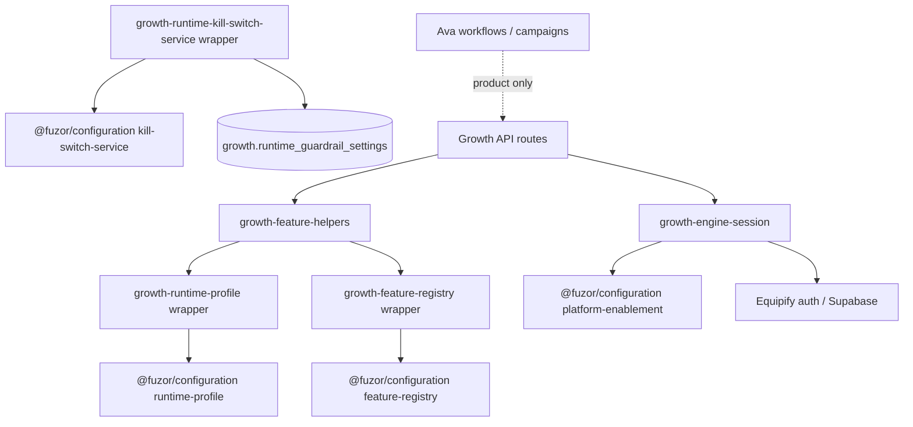

# FUZOR-ADOPTION-1G — Runtime Enablement & Persona Profile Delegation

**Milestone ID:** FUZOR-ADOPTION-1G  
**Status:** Complete (local adoption)  
**Effective:** 2026-07-22  
**Platform prerequisite:** Certified for Multi-Tenant Platform Operation (Hardening 1A)  
**Scope:** Delegate runtime profile, enablement env, and kill-switch service into `@fuzor/configuration`

---

## Executive summary

| Item | Result |
|------|--------|
| Runtime profile authority | `@fuzor/configuration` (`runtime-profile.ts`) |
| Capability registry authority | `@fuzor/configuration` (Adoption 1D) |
| Platform enablement env | `@fuzor/configuration` (`platform-enablement.ts`) |
| Kill-switch persistence service | `@fuzor/configuration` (`runtime-kill-switch-service.ts`) |
| Equipify role | Compatibility consumer (thin wrappers) |
| Import paths | Unchanged |
| Schema / migrations | Unchanged |
| Production validation | **Not performed** — separate milestone |

**Constitutional split:** Platform answers *what is this persona allowed to do?* Products answer *when and why should the persona do it?*

**Lifecycle:** **Extracted** · **Adopted** · **Validated (local)** — not Production Validated

---

## Phase 1 — Runtime audit

### Equipify file classification

| File | Classification | 1G action |
|------|----------------|-----------|
| `lib/growth/runtime/growth-runtime-profile.ts` | Runtime profile | **Delegated** → `@fuzor/configuration` |
| `lib/growth/runtime/growth-feature-registry.ts` | Capability registry | Already delegated (1D) |
| `lib/growth/runtime-guardrails/growth-runtime-guardrail-config.ts` | Guardrail constants | Already delegated (1D) |
| `lib/growth/aios/learning/growth-adaptive-calibration-config-registry.ts` | Calibration registry | Already delegated (1D) |
| `lib/growth/aios/learning/growth-adaptive-calibration-config-resolver.ts` | Calibration resolver | Already delegated (1D) |
| `lib/growth/growth-engine-session.ts` (env readers) | Platform enablement | **Partial delegate** — env only |
| `lib/growth/runtime-guardrails/growth-runtime-kill-switch-service.ts` | Kill-switch persistence | **Delegated** → `@fuzor/configuration` |
| `lib/growth/runtime/growth-feature-helpers.ts` | Phase 8H enforcement | **Retained** — product wiring |
| `lib/growth/runtime-guardrails/growth-runtime-*-service.ts` (budgets, wake, etc.) | Product runtime services | **Retained** |
| `lib/growth/aios/learning/growth-adaptive-calibration-apply-*` | Calibration apply workflow | **Retained** |
| Autonomy / RBAC / provider capability registries | Product policy | **Retained** |
| Ava prompts, workflows, DataMoon, campaigns | Product behavior | **Retained** |

### Fuzor canonical modules

| Module | Classification |
|--------|----------------|
| `runtime-profile.ts` | **Canonical runtime profiles** |
| `feature-registry.ts` | **Canonical capability registry** |
| `platform-enablement.ts` | **Canonical enablement env contracts** |
| `runtime-kill-switch-service.ts` | **Canonical kill-switch persistence** |
| `runtime-guardrail-config.ts` | **Canonical guardrail defaults** |
| `calibration-registry.ts` / `calibration-resolver.ts` | **Canonical calibration defaults** |

### Dependency graph



---

## Phase 2 — Ownership classification

### Fuzor owns

- Runtime profile definitions (`operator_minimal`, `full_admin`, `development_all`)
- Profile resolution from env (`GROWTH_RUNTIME_PROFILE`, Vercel/NODE_ENV defaults)
- Capability registry (tiers, modes, cold-storage intent)
- Platform enablement env (`GROWTH_ENGINE_ENABLED`, `GROWTH_ENGINE_AI_ORG_ID`)
- Kill-switch default map and persistence service
- Calibration default registry and deterministic resolver
- Guardrail static limits and budget caps

### Equipify owns

- Phase 8H feature enforcement wiring (`growth-feature-helpers.ts`)
- Shell/API mount guards and cold-storage runtime behavior
- Budget, wake, retention, rate-limit guardrail services
- Adaptive calibration apply workflow, UI, and org-scoped persistence
- Autonomy policy, RBAC, execution sequencing
- Ava prompts, workflows, Growth Engine, DataMoon
- Operator UX, onboarding, campaigns, business rules
- Database migrations and RLS

---

## Phase 3 — Runtime delegation

### `lib/growth/runtime/growth-runtime-profile.ts`

Thin wrapper re-exporting `@fuzor/configuration` runtime profile constants and resolvers under Growth-prefixed names. No local profile table duplication.

### `lib/growth/growth-engine-session.ts`

`isGrowthEngineEnabledEnv()` and `getGrowthEngineAiOrgId()` delegate to `isPlatformGrowthEngineEnabledEnv()` and `readPlatformGrowthEngineAiOrgIdFromEnv()`. Auth, Supabase session resolution, and logging remain Equipify-owned.

### `lib/growth/runtime-guardrails/growth-runtime-kill-switch-service.ts`

All four exports (`isRuntimeKillSwitchEnabled`, `getRuntimeKillSwitchStates`, `setRuntimeKillSwitch`, `isWakeExecutionEnabled`) delegate to platform kill-switch service. Schema probe logic moved to Fuzor (`probePlatformRuntimeGuardrailSettingsTable`).

---

## Phase 4 — Tenant validation

Runtime profile and capability registry are **process-global configuration** (not per-organization records). Tenant safety for this milestone:

| Surface | Tenant model |
|---------|--------------|
| Runtime profiles | Env-scoped; no org inference |
| Feature registry | Static; no tenant state |
| Platform enablement env | Explicit env only; no defaults that infer tenant |
| Kill-switch persistence | Org-agnostic guardrail table (existing schema); no cross-tenant leakage in service layer |
| Persona identity (1F) | Explicit `organizationId` required |

No process-global tenant defaults introduced. No `.env.local` added.

---

## Phase 5 — Capability validation

| Capability area | Parity evidence |
|-----------------|-----------------|
| Profile defaults | `GROWTH_RUNTIME_PROFILES === PLATFORM_RUNTIME_PROFILES` (reference equality) |
| Profile resolution | Env reader injection resolves `full_admin` identically |
| Feature registry | 1D parity test (unchanged) |
| Enablement env | `GROWTH_ENGINE_ENABLED` / `GROWTH_ENGINE_AI_ORG_ID` delegate with test reader |
| Kill-switch defaults | 1D static contract parity (unchanged) |
| Serialization / ordering | Profile IDs and tier policies deep-equal across wrappers |

---

## Phase 6 — Compatibility

Existing Equipify imports unchanged:

- `@/lib/growth/runtime/growth-runtime-profile`
- `@/lib/growth/growth-engine-session` (env helpers)
- `@/lib/growth/runtime-guardrails/growth-runtime-kill-switch-service`

No widespread import churn. Direct `@fuzor/configuration` imports remain limited to shim files and test scripts.

---

## Phase 7 — Future multi-product runtime model

Architecture proof (no runtime implementation):

```
Equipify → Ava → Runtime Profile A (operator_minimal)
Insideify → Ivy → Runtime Profile B (full_admin)
```

Both products consume identical `@fuzor/configuration` infrastructure. Profile selection is env-driven per deployment; capability registry is shared. Products layer workflows, prompts, and execution policy on top without duplicating platform contracts.

Parity test: `scripts/test-fuzor-adoption-1g-runtime-profile-parity.ts`

---

## Phase 8 — Validation

| Check | Result |
|-------|--------|
| `@fuzor/configuration` unit tests | **PASS** (22 tests) |
| `@fuzor/identity` unit tests | **PASS** (33 tests) |
| `test:fuzor-adoption-1g-runtime-profile-parity` | **PASS** |
| `test:fuzor-adoption-1d-configuration-constant-parity` | **PASS** |
| `test:fuzor-adoption-1f-persona-repository-parity` | **PASS** |
| `test:fuzor-adoption-1b-identity-actor-catalog` | **PASS** |

Script: `pnpm test:fuzor-adoption-1g-runtime-profile-parity`

---

## Remaining product ownership (Equipify)

- `growth-feature-helpers.ts` — Phase 8H enforcement
- Runtime guardrail services (budgets, wake, retention, rate limiting)
- Adaptive calibration apply workflow and UI
- Autonomy / approval / outbound authorization
- Ava activation, campaigns, DataMoon
- All operator UX and business policy

---

## Lifecycle

| Stage | Status |
|-------|--------|
| Extracted | Complete (Fuzor `@fuzor/configuration`) |
| Adopted | Complete (Equipify compatibility wrappers) |
| Validated (local) | Complete |
| Production validated | **Not started** — separate milestone |
