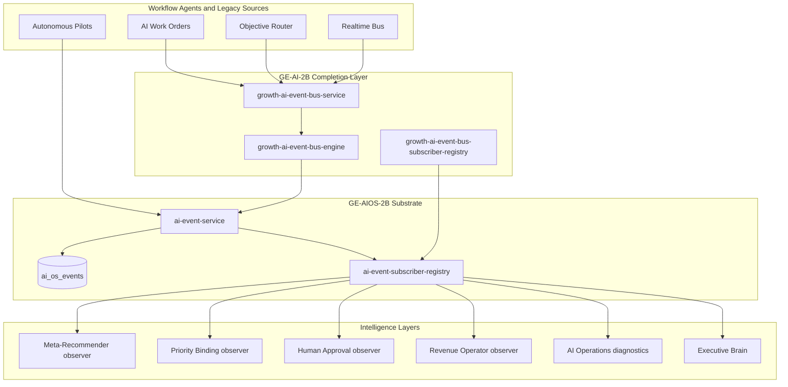

# GE-AI-2B — AI Revenue OS Event Bus Completion

**Phase:** GE-AI-2B  
**Status:** Complete locally (not committed)  
**Layer:** Infrastructure supporting Workflow Agents  
**QA marker:** `growth-ge-ai-2b-event-bus-completion-v1`

---

## Objective

Complete the AI Revenue OS Event Bus so Workflow Agents publish canonical events and supervisory/intelligence layers consume them via subscription rather than direct service coupling — without changing workflow behavior or introducing user-facing capabilities.

---

## Event source audit

| Event Source | Event Type (examples) | Publisher | Current Consumers | Reuse Strategy |
| ------------ | --------------------- | --------- | ----------------- | -------------- |
| AI OS event bus (`ai_os_events`) | `work_order.*`, `decision.*`, `agent.*`, `growth.*` | 25+ AI OS services | Command center, agent events, Executive Brain | **Extend** — canonical substrate (GE-AIOS-2B) |
| Mission / objective router | `mission.signal.{signalType}` | `growth-objective-event-router` | Objective runtime | **Bridge** — dual-write via GE-AI-2B completion |
| AI work orders | `work_order.created`, `work_order.status_changed` | `ai-work-order-service` | Work order audit trail | **Bridge** — dual-write to `ai_os_events` |
| Growth lead-research workflow | `growth.workflow.status_changed` | `growth-lead-research-workflow-service` | Agent events, command center | Already on bus — normalize lifecycle aliases |
| Autonomous pilot agents | `agent.wake`, `growth.qualification.completed`, etc. | Pilot services | Agent events routing table | Already on bus — extend mapping |
| Realtime UI bus | `realtime.*` | `realtime-events-service` | Operator inbox, command center UI | **Bridge** — one-way to AI OS (no merge) |
| AI decision records | `decision.recorded`, `decision.linked` | `ai-decision-record-service` | Command center decisions | Already on bus |
| Notification events | Growth notification taxonomy | Notification repository | User alerts | **Do not unify** — out of scope |
| Automation GE-v1.5 | Playbook signals | Signal processor | Objective router fan-in | Indirect via objective bridge |
| Command center read model | N/A (pull) | `ai-os-command-center-service` | UI surfaces | Pull + event bus health diagnostics |
| Meta-recommender (2F) | N/A (synthesis) | Read-model engine | Command center, API | Observer subscriber + pull read model |
| Priority binding (2E) | N/A (synthesis) | Read-model engine | Command center, API | Observer subscriber + pull read model |
| Human approval center (2H) | N/A (aggregation) | Collector engine | Command center, API | Observer subscriber + pull read model |
| Revenue Operator (4B) | Plan-state derived | Orchestration engine | Command center | Observer + `listAiOsEvents` pull |
| Executive Brain (2G) | `executive.*` | Executive services | Mission planning | DB subscription + in-process handler |

---

## Canonical event model

GE-AI-2B introduces `GrowthAiEvent` as a **projection envelope** over the existing `AiOsEvent` substrate — no duplicate tables.

Mapping lives in `lib/growth/aios/event-bus/growth-ai-event-bus-types.ts`.

Key fields: `category`, `eventType`, `entityType`, `entityId`, `producer`, `payload`, `metadata` (correlationId, traceId, workflowAgent), and nested `aiOs` for backward compatibility.

---

## Publisher matrix

| Producer | Events | Bridge |
| -------- | ------ | ------ |
| Research workflow | `growth.workflow.status_changed` | Direct |
| Qualification pilot | `growth.qualification.completed`, `agent.wake` | Direct |
| Planning pilot | `growth.execution_plan.generated`, `agent.wake` | Direct |
| Execution pilot | `growth.execution.enqueued`, `agent.wake` | Direct |
| Outreach prep pilot | `growth.outreach.prepared`, `agent.wake` | Direct |
| Meeting pilot | `growth.meeting.prepared`, `agent.wake` | Direct |
| Execution plan review | `growth.execution_plan.review_changed` | Direct |
| AI work orders | `work_order.*` | GE-AI-2B bridge |
| Objective router | `mission.signal.*` | GE-AI-2B bridge |
| Realtime bus | `realtime.*` | GE-AI-2B bridge |
| Decision engine | `decision.*` | Direct (existing) |

### Workflow lifecycle aliases (no duplicate emission)

| AI OS eventType | Lifecycle alias |
| --------------- | --------------- |
| `agent.wake` | ResearchStarted |
| `growth.workflow.status_changed` | ResearchCompleted |
| `growth.qualification.completed` | QualificationCompleted |
| `growth.execution_plan.generated` | PlanningCompleted |
| `growth.execution.enqueued` | ExecutionPrepared |
| `growth.outreach.prepared` | OutreachPrepared |
| `growth.meeting.prepared` | MeetingPrepared |
| `growth.execution_plan.review_changed` | ApprovalRequested |
| `decision.approval_required` | ApprovalRequested |
| `decision.gate_passed` | ApprovalGranted |
| `decision.gate_blocked` | ApprovalRejected |

---

## Subscriber matrix

| Subscriber ID | Role | Mode |
| ------------- | ---- | ---- |
| `meta_recommender_observer` | Observes decision/mission/work_order/growth events | In-process + DB subscription |
| `priority_binding_observer` | Observes mission/priority/meta-rec signals | In-process + DB subscription |
| `human_approval_center_observer` | Observes approval/work_order events | In-process + DB subscription |
| `ai_operations_observer` | Read-only diagnostics feed | In-process + DB subscription |
| `revenue_operator_observer` | Agent/growth event observation | In-process + DB subscription |
| `agent_events_observer` | Extends 4C agent event routing | In-process + DB subscription |
| `decision_engine_observer` | Decision/work_order observation | In-process + DB subscription |
| `memory_registry_observer` | Memory/context events | In-process + DB subscription |
| `executive_brain` | Mission planning (existing 2G) | DB subscription + handler |

Read-model synthesizers (2F/2E/2H) remain pull-based for command center assembly; observers prove event paths without changing UI behavior.

---

## Event lifecycle diagram



---

## Files changed

| File | Change |
| ---- | ------ |
| `lib/growth/aios/event-bus/growth-ai-event-bus-types.ts` | Canonical envelope, lifecycle aliases |
| `lib/growth/aios/event-bus/growth-ai-event-bus-engine.ts` | Subscriber defs, health synthesis |
| `lib/growth/aios/event-bus/growth-ai-event-bus-subscriber-registry.ts` | Observer registration |
| `lib/growth/aios/event-bus/growth-ai-event-bus-service.ts` | Publish/bridge/health API |
| `lib/growth/aios/ai-event-subscriber-registry.ts` | Isolated subscriber failures |
| `lib/growth/aios/ai-event-service.ts` | `handlerFailures` in publish result |
| `lib/growth/aios/ai-event-registry.ts` | Pilot + bridge event types |
| `lib/growth/aios/ai-work-order-service.ts` | Work order bridge wiring |
| `lib/growth/objectives/growth-objective-event-router.ts` | Objective bridge wiring |
| `lib/growth/realtime-events/realtime-events-service.ts` | Realtime bridge wiring |
| `lib/growth/aios/growth/growth-agent-event-engine.ts` | Extended AI OS to agent event mapping |
| `lib/growth/aios/ai-os-command-center-types.ts` | `eventBusHealth` on read model |
| `lib/growth/aios/ai-os-command-center-service.ts` | Health fetch + subscription ensure |
| `lib/growth/aios/ai-os-operations-dashboard-synthesizer.ts` | Event bus engineering diagnostic |
| `scripts/test-ge-ai-2b-event-bus-completion.ts` | Certification |
| `package.json` | `test:ge-ai-2b-event-bus-completion` script |

---

## Tests run

```bash
pnpm test:ge-ai-2b-event-bus-completion
```

Includes regressions: 2H, 2E, 2F, PROD-REGRESSION-6, 5C, GE-AIOS-2B foundation, 4C agent events.

---

## Backward compatibility

- Existing `AiOsEvent` schema, tables, and `publishAiOsEvent` API unchanged.
- All new behavior is additive: bridges dual-write; observers are side-effect-free counters.
- Bridge failures are swallowed at source — legacy flows never blocked.
- Subscriber handler failures isolated per handler — publisher never fails.
- Command center read models (2F/2E/2H) unchanged in synthesis logic; only `eventBusHealth` added.
- AI Operations dashboard adds read-only engineering diagnostic row — no controls.

---

## Future extension points (design only)

| Extension | Subscription model |
| --------- | ------------------ |
| Revenue Director | Subscribe to `decision.*`, `agent.escalated`, `mission.completed` |
| Closed-loop learning | Subscribe to `learning.*`, `decision.recorded`, outcome feedback events |
| Memory Graph projection | Subscribe to `memory.*`, `context.assembled`, entity-linked events |
| Communication Engine | Subscribe to `conversation.*`, `approval.*`, outbound-prep events |
| Analytics | Subscribe to all categories with read-only warehouse fan-out |

Event precedence / interrupt (Constitution section 9) remains deferred.

---

## Remaining technical debt

- Read-model synthesizers still pull directly — incremental event-driven projection not yet implemented.
- `meta_recommender.conflict_resolved` registered but not emitted on synthesis.
- Sequence execution and lead timeline bridges stubbed in types, not wired.
- Event precedence / interrupt semantics not implemented.
- No external broker — intentional; scale via DB pull model.

---

## GE-AI-2I unblock status

GE-AI-2B completes the communication backbone. Combined with GE-AI-2H (unified approval inbox), GE-AI-2I L4 Supervised Outbound is architecturally unblocked — remaining work is the supervised outbound implementation itself.
