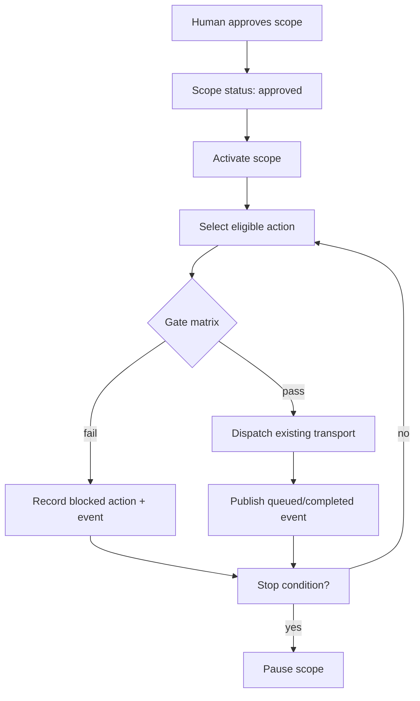

# GE-AI-2I — L4 Bounded Autonomous Outbound

**Phase:** GE-AI-2I  
**Status:** Complete locally (not committed)  
**Layer:** Outbound orchestration (delegates to existing transport)  
**QA marker:** `growth-ge-ai-2i-bounded-autonomous-outbound-v1`

---

## Objective

Implement bounded autonomous outbound: human approves scope once, then the system autonomously executes only inside approved limits when all gates pass.

---

## Gate matrix

| Path | Execution status | Approval gate | Autonomy gate | Caps/budget | Stop conditions | Reuse strategy |
| ---- | ---------------- | ------------- | ------------- | ----------- | --------------- | -------------- |
| Email sequence runtime | Per-job human approval today | `sequence-approval-gate` + scope approval | `evaluateAutonomyOutboundSendPolicyFromPolicyEngine` | Scope + org budgets | Reply/unsubscribe via scope | **Delegate** via `runSequenceExecutionJob` |
| SMS sequence runtime | Per-job approval | Same | Same (sms channel) | Scope SMS/day cap | Same | **Delegate** via sequence SMS runner path |
| Voice drop runtime | Disabled autonomous by default | Scope + `VOICE_DROP_APPROVAL_REQUIRED` | Autonomy + certification flag | Voice drops/day cap | Stop conditions | **Delegate** only if certified |
| AI Voice outbound | Blocked unless explicit | Scope `aiVoiceExplicitlyApproved` | Autonomy voice capability | Scope caps | Stop + manual pause | **Block** — no dial without explicit scope |
| Outreach prep agent | Package approval only | 2H collector | Prepare capability only | N/A | N/A | Scope source only |
| Execution agent | Internal workflows only | Work order approval | Execution pilot gates | Pilot budgets | Runtime failure | Out of outbound scope |
| Automation GE-v1.5 | Operator execute | GeV15 inbox | `outbound_send_execution_enabled` flag | Org budgets | Playbook stop | Not merged — separate path |
| Growth Autonomy | Policy engine | Always requires scope | Single policy plane | Daily budgets | Kill switches | **Canonical** gate |
| Human approval (2H) | Read-only inbox | Source authoritative | N/A | N/A | N/A | **Extend** with scope collector |
| Suppression | Active | N/A | N/A | N/A | Unsubscribe stop | `isEmailSuppressed` |
| Sender/readiness | Pre-send | N/A | N/A | N/A | N/A | `evaluateGrowthOutboundTransportReadiness` |
| Event bus (2B) | Lifecycle events | N/A | N/A | N/A | Stop triggers | `publishGrowthAiEvent` |

---

## Scope model

`GrowthAutonomousOutboundScope` in `lib/growth/aios/outbound/growth-autonomous-outbound-scope-types.ts`

Key fields: source, audience, allowedChannels, limits (total/day/lead/channel), quietHours, stopConditions, policy linkage to Growth Autonomy.

---

## Execution lifecycle



---

## Stop conditions

- onReply, onPositiveIntent, onNegativeIntent, onBounce, onUnsubscribe, onMeetingBooked, onManualPause
- Triggered via `triggerAutonomousOutboundStopCondition` → pauses scope + publishes event

---

## Channel coverage

| Channel | Transport path | Autonomous allowed |
| ------- | -------------- | ------------------ |
| email | `sequence_execution.runSequenceExecutionJob` | Yes, inside scope |
| sms | `sequence_execution.runSequenceSmsExecutionJob` | Yes, inside scope |
| voice_drop | `sequence_execution.runSequenceVoiceDropExecutionJob` | Only if certified + scope flag |
| ai_voice | Blocked orchestrator path | No unless explicit scope approval |
| linkedin_manual | Manual cadence task | Task creation only |
| video | SENDR queue task | Task queue only |

---

## Safety controls

1. No outbound without approved active scope
2. Growth Autonomy policy evaluation required
3. Audience allow-list enforced
4. Channel allow-list enforced
5. Budget/caps enforced (total, daily, per-lead, per-channel)
6. Quiet hours enforced
7. Suppression/opt-out blocks email
8. AI Voice blocked without explicit scope flag
9. Voice drop blocked when `VOICE_DROP_AUTONOMOUS_OUTBOUND_DISABLED`
10. No Core table mutations
11. No duplicate transport — delegates to sequence runtime only
12. Event bus lifecycle for audit trail

---

## Files changed

| File | Change |
| ---- | ------ |
| `lib/growth/aios/outbound/growth-autonomous-outbound-scope-types.ts` | Scope + action types |
| `lib/growth/aios/outbound/growth-autonomous-outbound-scope-engine.ts` | Gate matrix engine |
| `lib/growth/aios/outbound/growth-autonomous-outbound-scope-store.ts` | In-memory scope store |
| `lib/growth/aios/outbound/growth-autonomous-outbound-scope-service.ts` | Read model service |
| `lib/growth/aios/outbound/growth-bounded-autonomous-outbound-orchestrator.ts` | Execution orchestrator |
| `lib/growth/aios/approvals/growth-human-approval-center-engine.ts` | Scope collector |
| `lib/growth/aios/ai-os-command-center-types.ts` | `boundedAutonomousOutbound` |
| `lib/growth/aios/ai-os-command-center-service.ts` | Read model integration |
| `lib/growth/aios/ai-os-operations-dashboard-synthesizer.ts` | Engineering diagnostic |
| `lib/growth/aios/ai-event-registry.ts` | Lifecycle event types |
| `app/api/platform/growth/ai-os/bounded-autonomous-outbound/route.ts` | GET read model |
| `components/growth/ai-os/command-center/growth-ai-os-bounded-autonomous-outbound-section.tsx` | Read-only UI |
| `scripts/test-ge-ai-2i-bounded-autonomous-outbound.ts` | Certification |

---

## Tests run

```bash
pnpm test:ge-ai-2i-bounded-autonomous-outbound
```

Includes regressions: 2B, 2H, 2E, 2F, PROD-REGRESSION-6, 5C.

---

## Known limitations

- Scope store is in-memory (pilot pattern) — production persistence deferred
- LinkedIn/video dispatch records intent only — manual task creation path stubbed
- GeV1.5 automation execute not wired into bounded executor (separate approval surface)
- Positive intent stop requires upstream reply intelligence integration (gate exists, trigger manual)

---

## Remaining risks

- Dual approval model: per-sequence-job approval still required by sequence runtime even with scope approval
- Production persistence for scopes needed before multi-tenant rollout
- Voice drop certification flag must be explicitly set in deployment env

---

## Platform status

**Yes — the platform now supports bounded autonomous outbound** as an orchestration layer with full gate matrix, existing transport delegation, event bus lifecycle, and read-only operator surfaces. Production rollout requires scope persistence and operator activation workflows.
