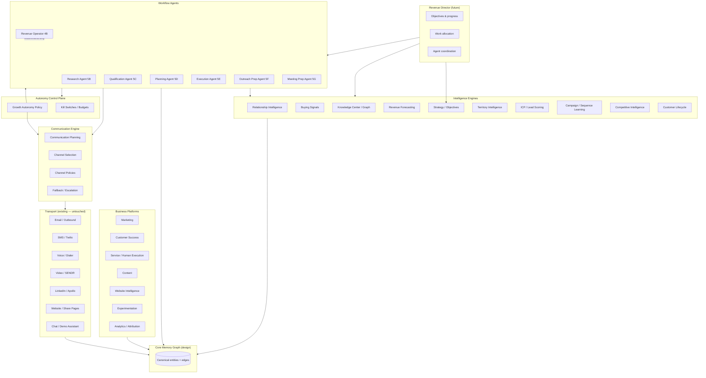

# GE-AIOS-ARCH-1A — AI Revenue & Service OS Architecture Consolidation

**Status:** Complete (architecture-only — no implementation)  
**Date:** 2026-06-25  
**Authority:** Constitution v1.0 — [`docs/architecture/AI_REVENUE_OPERATOR_CONSTITUTION_v1.0.md`](./architecture/AI_REVENUE_OPERATOR_CONSTITUTION_v1.0.md)  
**Living state:** [`docs/MASTER_CONTEXT_DOCUMENT.md`](./MASTER_CONTEXT_DOCUMENT.md)

---

## Executive summary

Equipify already contains ~65–70% of the infrastructure for a true AI Revenue & Service Operating System. GE-AIOS-ARCH-1A consolidates every existing module into a **single canonical layer model** so all future phases extend one architecture — not parallel stacks.

**Locked rules preserved:**

- Production-first; Vercel Production env only; no `.env.local`
- Growth Autonomy is the **single policy control plane** (`/growth/settings/autonomy`)
- AI Operations remains **read-only**
- Human approval required before **all external outbound actions**
- Extend existing systems; never duplicate implementations
- Revenue Director is **defined only** — not built in this phase

---

## Canonical layer model

```
Revenue Director (future — coordinates, never executes)
        │
────────────────────────────────────────────────────────
Workflow Agents (independent; one responsibility each)
  Research · Qualification · Planning · Execution
  Outreach Preparation · Meeting Preparation
  Revenue Operator (supervisor — recommendation only today)
────────────────────────────────────────────────────────
Intelligence Engines (reusable providers — no workflow ownership)
  Relationship · Buying Signals · Knowledge · Forecasting
  Strategy · Territory · ICP · Campaign Learning
  Competitive · Customer Lifecycle · Deal · Call · Market Graph
────────────────────────────────────────────────────────
Communication Engine (planning + channel policy — not transport)
  Communication Planning · Channel Selection · Fallback · Escalation
  Sequencing · Channel policies
  (Transport remains in existing outbound/SMS/voice/video modules)
────────────────────────────────────────────────────────
Business Platforms (domain products — not agents)
  Marketing · Customer Success · Service · Content
  Website Intelligence · Experimentation · Analytics
────────────────────────────────────────────────────────
Core Memory Graph (canonical write target — design only)
  Company · Contact · Relationship · Meeting · Call · Email · SMS
  Video · Website Visit · Proposal · Quote · Invoice · Opportunity
  Service Event · Support Event · Campaign · Outcome · Recommendation
  Knowledge · Buying Signal
────────────────────────────────────────────────────────
AI OS Foundations (cross-cutting — already built)
  Work Orders · Events · Decision Records · Agent Runtime
  Executive Brain · Context Assembly · LLM Providers · Autonomy Policy
```

---

## Layer dependency diagram



**Dependency rules:**

1. Workflow Agents **consume** Intelligence Engines and **request** Communication Engine plans — they do not embed scoring or transport.
2. Transport modules **never** bypass Growth Autonomy or human approval gates.
3. Revenue Director (future) sits above Workflow Agents; it **never** calls transport or execution directly.
4. Core Memory Graph is the **eventual unified read/write facade**; today GE-AIOS-2F bindings point at existing Growth tables without duplication.

---

## Part 1 — Module mapping matrix

Scope: primary systems under `lib/growth/` (~156 domain modules). Full file inventory: `lib/admin/master-context.generated.ts`.

| Existing System | Architectural Layer | Status | Action |
| --------------- | ------------------- | ------ | ------ |
| **AI OS foundations** | | | |
| `lib/growth/aios/ai-work-order-*` | AI OS Foundations | Built (2A) | Keep |
| `lib/growth/aios/ai-event-*` | AI OS Foundations | Built (2B) | Extend — bridge legacy substrates |
| `lib/growth/aios/ai-decision-record-*` | AI OS Foundations | Built (2D) | Keep |
| `lib/growth/aios/ai-agent-runtime-*` | AI OS Foundations | Built (2C) | Keep |
| `lib/growth/aios/ai-executive-brain-*` | AI OS Foundations / Revenue Director precursor | Built (2G) | Extend — bind to Revenue Director |
| `lib/growth/aios/ai-memory-*` | Core Memory Graph (facade) | Built (2F) | Extend — expand entity bindings |
| `lib/growth/aios/ai-os-command-center-*` | AI Operations (read-only) | Built (5C) | Keep |
| `lib/growth/aios/ai-os-daily-briefing-*` | AI Operations | Built (5D) | Keep |
| `lib/growth/aios/ai-os-operations-dashboard-*` | AI Operations | Built (CONSOLIDATION-1B) | Keep |
| **Workflow Agents** | | | |
| `growth-autonomous-research-pilot-*` (5B) | Workflow Agent — Research | Built | Keep |
| `growth-autonomous-qualification-pilot-*` (5C) | Workflow Agent — Qualification | Built | Keep |
| `growth-autonomous-planning-pilot-*` (5D) | Workflow Agent — Planning | Built | Keep |
| `growth-autonomous-execution-pilot-*` (5E) | Workflow Agent — Execution | Built | Keep |
| `growth-autonomous-outreach-preparation-pilot-*` (5F) | Workflow Agent — Outreach Preparation | Built | Keep |
| `growth-autonomous-meeting-pilot-*` (5G) | Workflow Agent — Meeting Preparation | Built | Keep |
| `growth-revenue-operator-orchestration-*` (4B) | Workflow Agent — Revenue Operator (supervisor) | Built | Extend — evolve toward Revenue Director staff |
| `growth-agent-framework-*` (4A) | Workflow Agent registry | Built | Keep |
| `growth-agent-event-*` (4C) | Workflow Agent event routing | Built (scheduler inactive) | Extend — activate when Revenue Director ready |
| `growth-agent-memory-*` (4D) | Workflow Agent shared context | Built | Keep — feeds Memory Graph |
| `aios/pilot/lead-research-pilot-*` (4A legacy) | Workflow Agent — Research (legacy) | Built | Merge — normalize into 5B + GROWTH-1A workflow |
| `lib/growth/agent-orchestration/*` (GS-4D) | Workflow Agent (parallel model) | Cold | Deprecate — fold recommendations into Revenue Operator or retire |
| **Intelligence Engines** | | | |
| `recompute-relationship-intelligence.ts`, `relationship-*` | Intelligence — Relationship | Built | Keep |
| `signals/`, `signal-intelligence/`, `reply-intelligence/buying-signal-*` | Intelligence — Buying Signals | Built | Extend — unify signal taxonomy |
| `knowledge-center/` | Intelligence — Knowledge | Built | Keep |
| `market-intelligence/`, `graph-expansion/`, `canonical-companies/` | Intelligence — Knowledge Graph | Built | Extend |
| `revenue-forecast-*`, `recompute-revenue-forecast.ts` | Intelligence — Forecasting | Built | Keep — bind to Meta-Recommender |
| `objectives/`, `growth-mission-framework-*` | Intelligence — Strategy | Built | Keep |
| `territory-intelligence/` | Intelligence — Territory | Built | Keep |
| `lead-engine/icp-targeting-*`, `lead-score-*` | Intelligence — ICP Learning | Partial | Extend — GE-AI-2J learning loop |
| `sequence-intelligence/`, `playbooks/outcomes/` | Intelligence — Campaign Learning | Partial | Extend |
| `conversation-competitors.ts`, market competitive overlap | Intelligence — Competitive | Partial | Extend |
| `customer-lifecycle/`, `account-intelligence/`, `company-intelligence/` | Intelligence — Customer Lifecycle | Built | Keep |
| `deal-intelligence/` | Intelligence — Deal | Built | Keep |
| `call-intelligence/` | Intelligence — Call | Built | Keep |
| `revenue-intelligence/process-revenue-intelligence.ts` | Intelligence — Hub orchestrator | Built | Extend — route through Meta-Recommender |
| `next-best-action.ts`, `recompute-lead-next-best-action.ts` | Intelligence — Recommendation | Built | Merge — into GE-AI-2F Meta-Recommender |
| 10+ parallel score engines (see § Duplicate analysis) | Intelligence — Scoring | Fragmented | Merge — GE-AI-2F |
| **Communication Engine** | | | |
| `multichannel/channel-task-planner.ts` | Communication — Planning | Built | Extend — canonical planner |
| `multichannel/channel-routing.ts` | Communication — Channel Selection | Built | Extend |
| `multichannel/channel-approval-gate.ts` | Communication — Policy / Approval | Built | Keep — part of human approval chain |
| `multichannel/channel-task-runner.ts` | Transport execution bridge | Built | Keep — transport boundary |
| `outreach/personalization/`, `personalization/`, `sendr/growth-sendr-personalization-*` | Communication — Message drafting | Built | Keep — consumed by 5F |
| `sms/personalization/` | Communication — SMS drafting | Built | Extend — parity with email in approval UX |
| `sequence-enrollment/`, `sequences/` | Communication — Sequencing | Built | Keep |
| **Transport (not Communication Engine ownership)** | | | |
| `outbound/` (Lemlist, message-repository) | Transport — Email | Built | Keep |
| `mailboxes/`, `sender/` | Transport — Email | Built | Keep |
| `sms/send-sms.ts`, `providers/twilio-sms-provider.ts` | Transport — SMS | Built | Keep — promote to first-class approval UX |
| `native-dialer/`, `communication/call-dial.ts` | Transport — Calls | Built | Keep |
| `apollo/` (voice drop) | Transport — Voice drops | Built | Keep |
| `media/media-voice-generation-service.ts` | Transport — AI Voice | Built | Keep |
| `videos/`, `media/media-video-generation-service.ts` | Transport — Video | Built | Keep |
| `social-profile-discovery/` (LinkedIn enrichment) | Transport — LinkedIn (enrichment only) | Partial | Future — first-class send transport |
| `sendr/growth-sendr-public-page-service.ts`, share-pages | Transport — Website | Built | Keep |
| `demo-assistant/`, `media/media-conversational-session-service.ts` | Transport — Chat / Voice AI | Built | Keep |
| **Business Platforms** | | | |
| `outbound-launch/`, `audiences/`, `campaign-builder/`, `sendr/`, `intent-pixel/` | Marketing | Built | Keep |
| `customer-lifecycle/` (health, onboarding) | Customer Success | Built | Extend |
| `human-execution/`, `operator-handoff/`, `operator-inbox/` | Service / Human Execution | Built | Keep |
| `content/` (templates, snippets, approval) | Content | Built | Keep |
| `research-website-*`, `browser-intake/`, `company-growth-signals/` | Website Intelligence | Built | Keep |
| `experiments/` | Experimentation | Built | Keep |
| `revenue-attribution/`, `engagement/`, `sendr/growth-sendr-analytics-*` | Analytics | Built | Keep |
| `automation/`, `automation-runtime/` (GE-V1-5) | Marketing Automation Platform | Built | Extend — unify approval inbox |
| **Autonomy & policy** | | | |
| `autonomy/growth-ai-os-autonomy-policy-*` | Autonomy Control Plane | Built (CONSOLIDATION-1C/1E) | Keep — single write surface |
| `autonomy/growth-autonomy-*` (GE-AUTO) | Autonomy Control Plane (legacy settings) | Built | Extend — fully subsume under policy engine |
| **Memory & learning** | | | |
| `lead-memory/` | Core Memory Graph (lead facet) | Built | Extend — canonical binding |
| `playbooks/outcomes/` | Core Memory Graph (outcome facet) | Partial | Extend — GE-AI-2J |
| `timeline-emitter.ts`, `timeline-repository.ts` | Core Memory Graph (activity facet) | Built | Merge — into unified event projection |
| **Revenue Director (future)** | | | |
| `ai-executive-brain-*` + `objectives/` + `growth-mission-priority-*` | Revenue Director precursor | Partial | Future — formalize as Revenue Director |
| Executive Operating dashboard (`executive-operating-*`) | Revenue Director read model (duplicate) | Built | Merge — with AI Operations executive overview |

---

## Part 2 — Workflow Agent verification

Each agent must remain **independent** (do not merge). Verification against the six ownership criteria:

| Agent | Responsibility | Policy gate | Event stream | Retry strategy | Approval boundary | Budget |
| ----- | -------------- | ----------- | ------------ | -------------- | ----------------- | ------ |
| **Research** (5B) | Refresh lead/company research internally | `researchAutonomyEnabled` + kill switches | `agent.wake`, `growth.workflow.status_changed` | None per-lead cap | No outbound, no Work Order mutation | 10/hr · 100/day |
| **Qualification** (5C) | Opportunity assessment after research | `qualificationAutonomyEnabled` | `agent.wake`, `growth.qualification.completed` | 3 retries/lead/day | Planning-only; no execution | 20/hr · 200/day |
| **Planning** (5D) | Generate execution plans | `planningAutonomyEnabled` + mission planning gate | `agent.wake`, `growth.planning.execution_plan_generated` | 2 retries/lead/day | Plans → 1D approval queue only | 15/hr · 150/day |
| **Execution** (5E) | Internal mutation runtime (`research_company` pilot) | Full gate stack + `executionAutonomyEnabled` + runtime pilot | `agent.wake`, `growth.execution.enqueued`, runtime lifecycle events | 2 retries/plan/day | Internal only; no outbound/Core | 5/hr · 25/day |
| **Outreach Preparation** (5F) | Draft multichannel outreach packages | `outreachAutonomyEnabled` | `agent.wake` (`transport_blocked`), `growth.outreach.prepared` | 3 retries/lead/day | Draft-only; `pending_human_approval` | 20/hr · 200/day |
| **Meeting Preparation** (5G) | Draft meeting briefs/packages | `meetingAutonomyEnabled` | `agent.wake` (`calendar_blocked`, `booking_blocked`), `growth.meeting.prepared` | 3 retries/lead/day | Preparation-only; no calendar/booking | 20/hr · 200/day |
| **Revenue Operator** (4B) | Supervise handoffs; recommend next agent | Read-only; `supervisor_recommendation_only` | Consumes 4C agent events; no orchestration writes | N/A | Never executes; escalates to human review | N/A |

**Shared infrastructure (correct — not merged into agents):**

- Policy: `fetchGrowthAiOsAutonomyPolicyEvaluationContext` (CONSOLIDATION-1E)
- Events: `growth.ai_os_events` via `ai-event-service.ts`
- Gates (4A): approval, readiness, handoff, preflight, boundary, dry_run (+ runtime_pilot, operator_approval)

**Recommended improvements (do not merge agents):**

1. **Research Agent** — Add explicit per-lead retry cap (qualification/planning already have one).
2. **Revenue Operator** — Publish supervisor recommendations as read-only Decision Records for audit trail.
3. **All pilots** — Ensure scheduler activation (5A) gates wake cycles through Revenue Director allocation (future).
4. **Outreach / Meeting** — Promote SMS drafts to same approval surface as email (GE-AI-2H L3 approval flow).
5. **Legacy lead-research pilot (4A)** — Document deprecation path; 5B + GROWTH-1A are canonical.

---

## Part 3 — Intelligence Engine inventory

Intelligence Engines **must not own workflow**. They expose deterministic or LLM-assisted **read models** consumed by Workflow Agents, Communication Engine, and Business Platforms.

| Engine | Primary modules | Inputs | Outputs | Consumers | Caching | Maturity | Missing |
| ------ | --------------- | ------ | ------- | --------- | ------- | -------- | ------- |
| **Relationship Intelligence** | `relationship-*`, `lead-memory/relationship-*`, `recompute-relationship-intelligence.ts` | Touches, engagement, call/email history | `relationship_strength_score/tier/trend` on leads | Forecast, inbox, operator dashboards, qualification | Denormalized on `growth.leads` | **Production** | Unified relationship graph edge model |
| **Buying Signals** | `signals/`, `signal-intelligence/`, `reply-intelligence/buying-signal-*`, `realtime-buying-signals.ts` | Website pixel, job postings, replies, share-page events | `growth.signal_events`, urgency/score fields | Qualification pilot, prospect search, revenue intelligence | Signal repository + workflow states | **Production** | Cross-channel signal deduplication standard |
| **Knowledge Graph** | `knowledge-center/`, `market-intelligence/`, `graph-expansion/`, `canonical-companies/` | Indexed evidence, ICP overlap, geo/tech patterns | Company relationships, coverage scores, RAG retrieval | Prospect search, territory, command center | Snapshots + provider cache | **Production** | Explicit graph query API for agents |
| **Forecasting** | `revenue-forecast-*`, `recompute-revenue-forecast.ts`, `objectives/growth-objective-forecast.ts` | Fit, engagement, relationship, readiness, signals | Probability tiers, trajectories, attention levels | Executive dashboard, mission priority, AI Operations | Denormalized on leads | **Production** | Objective-level forecast binding (GE-AI-2E) |
| **Strategy** | `objectives/`, `growth-mission-framework-*`, `ai-executive-mission-planning-*`, `ai-executive-planning-report-*` | Objectives, mission state, capacity | Mission plans, Work Order proposals (review-gated), planning reports | AI Operations, Mission Planning Review | DB snapshots + query-time synthesis | **Production** | Revenue Director objective ownership |
| **Territory** | `territory-intelligence/`, prospect-search territory overlay | Saved searches, geo filters, signal density | Territory scores, heatmaps | Prospect search UI | `growth.territory_*` tables | **Production** | Agent-consumable territory API |
| **ICP Learning** | `lead-engine/icp-targeting-*`, `prospect-search-ai-icp-config.ts`, `lead-score-*` | Operator ICP config, firmographics | Fit dimensions, qualification rules | Lead engine, qualification agent | Config snapshots | **Partial** | Closed-loop ICP refinement (GE-AI-2J) |
| **Campaign Learning** | `sequence-intelligence/`, `playbooks/outcomes/`, `campaign-revenue-attribution-phase6.ts` | Sequence engagement, reply outcomes | Guidance, playbook diagnostics, attribution | Sequence dashboards, copilot, inbox | Sequence state + outcome snapshots | **Partial** | Unified campaign outcome → agent feedback |
| **Competitive Intelligence** | `conversation-competitors.ts`, market `competitive_overlap`, lead-memory competitor signals | Conversation mentions, market overlap | Competitor pressure scores | Conversation recompute, deal adjustments | Recompute-time derivation | **Partial** | Dedicated competitive read model |
| **Customer Lifecycle** | `customer-lifecycle/`, `account-intelligence/`, `company-intelligence/`, `buying-committee-intelligence/` | Canonical companies, onboarding, CI jobs | Health scores, lifecycle timelines, committee maps | CS dashboards, qualification | `company_intelligence_snapshots` | **Production** | Service event integration |
| **Deal Intelligence** | `deal-intelligence/` | Pipeline stage, engagement, blockers | Deal scores, recommendations | Revenue queue, operator inbox | Per-deal snapshots | **Production** | Bind to Meta-Recommender |
| **Call Intelligence** | `call-intelligence/` | Transcripts, dispositions | Call scores, coaching signals | Live coaching, inbox | Call record denormalization | **Production** | Agent wake on call outcomes |

---

## Part 4 — Communication audit

### Separation: Communication Engine vs Transport

| Concern | Owner | Examples |
| ------- | ----- | -------- |
| **What to say, when, on which channel** | Communication Engine | `channel-task-planner`, personalization engines, 5F/5G draft services |
| **Channel selection & fallback** | Communication Engine | `channel-routing`, multichannel sequence steps, next-best-action |
| **Approval & policy** | Growth Autonomy + human approval | `channel-approval-gate`, 5F `pending_human_approval`, GeV1-5 inbox |
| **Actual send/connect** | Transport (existing modules) | Lemlist, Twilio SMS, dialer, video render, share page publish |

### Channel audit

| Channel | Transport module(s) | Planning / prep module(s) | SMS/Email parity | Action |
| ------- | -------------------- | ------------------------- | ---------------- | ------ |
| **Email** | `outbound/`, `mailboxes/`, `sender/` | `outreach/personalization/`, `sendr-personalization-*`, 5F draft | Email first-class in approval UX | Keep |
| **SMS** | `sms/send-sms.ts`, `twilio-sms-provider.ts` | `sms/personalization/` | **SMS not first-class in approval UX** | Extend (GE-AI-2H) |
| **Calls** | `native-dialer/`, `communication/call-dial.ts` | `call-copilot-*`, `live-coaching/` | N/A | Keep |
| **Voice drops** | `apollo/` voice drop | Apollo sequence planning | Partial | Keep |
| **AI Voice** | `media/media-voice-generation-service.ts` | Script generation | Partial | Keep |
| **AI Receptionist** | `demo-assistant/` (Retell) | Demo intent/recommendations | Partial | Keep |
| **Personalized video** | `videos/`, `media-video-generation-service.ts` | `growth-video-autopilot-*` | Partial | Keep |
| **Avatar video** | Media generation services | Script + personalization | Partial | Future |
| **LinkedIn** | Enrichment only (`social-profile-discovery/`) | Apollo multichannel drafts, `channel-task-planner` | No first-party send | Future transport |
| **Website** | `sendr-public-page-service`, share-pages | Page AI generation, workspace intelligence | N/A | Keep |
| **Forms** | Share page / intake flows | Content templates | N/A | Keep |
| **Chat** | `demo-assistant/`, conversational sessions | `conversational-playbooks/` | N/A | Keep |
| **Future channels** | — | Extend `GrowthCommunicationChannel` enum | — | Future |

### Recommended canonical transport interface (design only — do not implement)

All transports should eventually implement a shared contract:

```typescript
/** Canonical transport interface — design only (GE-AIOS-ARCH-1A). Not implemented. */
interface GrowthCommunicationTransport {
  readonly channelId: GrowthCommunicationChannel
  readonly transportKind: "sync" | "async" | "realtime"

  /** Health / deliverability probe — no send */
  probe(input: { organizationId: string }): Promise<TransportProbeResult>

  /** Prepare payload — does NOT send; returns draft for approval queue */
  prepare(input: TransportPrepareInput): Promise<TransportPrepareResult>

  /** Execute approved payload — ONLY callable after human approval + autonomy gate pass */
  execute(input: TransportExecuteInput): Promise<TransportExecuteResult>

  /** Ingest inbound events (webhooks) into Core Memory Graph projection */
  ingestInbound?(input: TransportInboundEvent): Promise<void>
}
```

**Existing modules map to this interface conceptually:**

- `prepare` → personalization engines, 5F/5G draft services, SMS draft assembly
- `execute` → `channel-task-runner`, `send-sms`, outbound Lemlist adapter
- `ingestInbound` → Twilio webhooks, inbox sync, reply intelligence

---

## Part 5 — Business Platforms audit

| Platform | Primary modules | UI surfaces | Duplicates / overlap | Recommendation |
| -------- | --------------- | ----------- | -------------------- | -------------- |
| **Marketing** | `outbound/`, `outbound-launch/`, `audiences/`, `sequences/`, `sequence-enrollment/`, `campaign-builder/`, `sendr/`, `intent-pixel/`, `apollo/` | `components/growth/hubs/campaigns/`, sendr, automation | Three outbound stacks (native, Apollo, SENDR) | **Consolidate** planning under Communication Engine; keep transports |
| **Customer Success** | `customer-lifecycle/` (health, onboarding, notifications) | Limited dedicated hub | Overlap with account-intelligence | **Extend** CS hub; bind health to Memory Graph |
| **Service** | `human-execution/`, `operator-handoff/`, `operator-inbox/` | Human identity evidence workspace | Overlap with operator inbox vs AI Operations attention | **Keep** separate — human execution is not agent workflow |
| **Content** | `content/` (templates, snippets, renderer, approval) | Share pages, video sections | Content approval vs multichannel approval | **Merge** approval routing in GE-AI-2H |
| **Website Intelligence** | `research-website-*`, `browser-intake/`, `company-growth-signals/`, `contact-discovery/` | Prospect search intelligence panels | Parallel to company-intelligence queue | **Extend** — single website evidence pipeline |
| **Experimentation** | `experiments/` (assignment, metrics, winner) | Experiment dashboard | None significant | **Keep** |
| **Analytics** | `revenue-attribution/`, `engagement/`, `sendr-analytics-*`, `automation-analytics-utils`, `deliverability-ops/` | Revenue attribution dashboards | Multiple analytics aggregators | **Consolidate** read models under Analytics platform facade |

---

## Part 6 — Core Memory Graph (design only)

### Design principle

The Core Memory Graph is the **canonical semantic model** for all revenue and service interactions. It does **not** replace existing tables immediately — GE-AIOS-2F already binds memory types to Growth stores. Future phases add **projection writers** and **graph edges** without duplicating data.

### Growth / Core isolation

| Domain | Schema | Boundary |
| ------ | ------ | -------- |
| **Growth Engine** | `growth.*` | Leads, campaigns, AI OS, autonomy, outbound — **no Core mutations** |
| **Equipify Core** | `public.*` | Work orders (service), invoices, quotes, customers, equipment — **operator business system** |
| **Bridge** | Explicit handoff contracts only | GE-AIOS-GROWTH-1F future execution handoff; Constitution §17 invariants |

AI agents **never** write to `public.invoices`, `public.quotes`, or Core work orders without a future constitutional amendment and dedicated bridge.

### Entity model (canonical)

| Entity | Exists today | Canonical source (current) | Future action |
| ------ | ------------ | -------------------------- | ------------- |
| **Company** | Yes | `growth.canonical_companies`, `company_intelligence_snapshots` | Keep — graph node |
| **Contact** | Yes | `growth.leads`, `canonical_persons` | Keep — link to Company |
| **Relationship** | Yes | `growth.relationship_context`, lead relationship fields | Keep — graph edge |
| **Meeting** | Partial | `meeting-intelligence/`, 5G preparation packages | Extend — no calendar write until approved bridge |
| **Call** | Yes | Call records + `call-intelligence/` | Keep |
| **Email** | Yes | `outbound/message-repository`, inbox threads | Keep — project to graph |
| **SMS** | Yes | SMS message tables + Twilio ingestion | Keep — project to graph |
| **Video** | Yes | `videos/`, SENDR assets | Keep |
| **Website Visit** | Yes | Intent pixel, share-page events | Keep |
| **Proposal** | Partial | Opportunity drafts (`meeting-intelligence/`) | Extend |
| **Quote** | Core only | `public.quotes` | **Separate** — read via bridge only |
| **Invoice** | Core only | `public.invoices` | **Separate** — read via bridge only |
| **Opportunity** | Yes | Pipeline / deal intelligence | Keep |
| **Service Event** | Core | Core work orders, scheduling | **Separate** — ingest via bridge |
| **Support Event** | Partial | Operator inbox, human execution | Extend |
| **Campaign** | Yes | Sequences, enrollments, automation runtime | Keep |
| **Outcome** | Partial | `playbooks/outcomes/`, sequence results | Extend — GE-AI-2J |
| **Recommendation** | Fragmented | 10+ score engines, next-best-action | **Merge** — Meta-Recommender canonical |
| **Knowledge** | Yes | `knowledge-center/`, signal-playbook binding | Keep |
| **Buying Signal** | Yes | `growth.signal_events` | Keep |

### Graph edge types (design)

```
Company ──has_contact──▶ Contact
Contact ──engaged_via──▶ Email | SMS | Call | Meeting | WebsiteVisit | Video
Contact ──in_relationship──▶ Relationship ──with──▶ Company
Company ──shows_signal──▶ BuyingSignal
Opportunity ──references──▶ Company, Contact
Campaign ──targeted──▶ Contact
Outcome ──resulted_from──▶ Campaign | WorkflowAgentRun
Recommendation ──applies_to──▶ Contact | Opportunity
Knowledge ──supports──▶ Recommendation
DecisionRecord ──explains──▶ WorkflowAgentRun | WorkOrder
```

### What should become canonical

1. **`growth.ai_os_events`** — system-of-record for agent lifecycle (already canonical for AI OS)
2. **`growth.ai_decision_records`** — system-of-record for explainability
3. **GE-AIOS-2F memory registry** — metadata facade over existing stores (extend, don't duplicate)
4. **Meta-Recommender output** (future GE-AI-2F) — single `Recommendation` entity type

### What should remain separate

- Core financial documents (quotes, invoices) — read-only to Growth via explicit bridges
- Transport provider credentials and raw webhook payloads — stay in transport modules
- In-memory pilot stores (5B–5G) — ephemeral until persisted run history migration (future)

---

## Part 7 — Closed-loop learning pipeline (design only)

Every completed **Outcome** should eventually feed back into Intelligence Engines and Communication policies. **Do not implement** — GE-AI-2J.

```
Outcome recorded (reply, meeting booked, deal won/lost, service completed, campaign result)
        │
        ▼
Outcome normalizer (channel, agent, playbook, ICP segment, mission)
        │
        ├──▶ Research quality weights
        ├──▶ Qualification threshold calibration
        ├──▶ Planning template selection
        ├──▶ Messaging / personalization templates (Communication Engine)
        ├──▶ Channel selection priors
        ├──▶ Forecast model features
        ├──▶ Relationship scoring coefficients
        ├──▶ ICP fit model updates (bounded, operator-reviewable)
        └──▶ Campaign / sequence optimization (playbook outcomes)
```

**Safety constraints:**

- Learning updates are **scoped per organization** and **mission-cooldown gated**
- No live mission mutation without operator visibility (Constitution §17)
- Kill switches block learning-triggered autonomous actions
- All learning deltas emit `growth.learning.calibration_proposed` events (future) — human approval for L3+ impact

---

## Part 8 — Revenue Director (definition only — do not build)

The **Revenue Director** is the executive coordination layer above Workflow Agents. It replaces the informal split between Executive Brain, Revenue Operator recommendations, and objective runtime ticks.

### Responsibilities

| Responsibility | Description |
| -------------- | ----------- |
| **Own objectives** | Bind `organization_growth_objectives` to measurable missions; set success criteria |
| **Measure progress** | Aggregate mission framework health, forecast trajectories, pipeline outcomes |
| **Allocate work** | Assign wake priority to Workflow Agents via scheduler (5A) and mission priority (4F) |
| **Coordinate agents** | Invoke Revenue Operator handoff logic; never execute agent workflows directly |
| **Read intelligence** | Consume all Intelligence Engines via Meta-Recommender (GE-AI-2F) |
| **Surface decisions** | Propose Work Orders and Decision Records for operator review |

### Explicit prohibitions

- **Never perform workflow itself** — no research, qualification, planning, execution, outreach, or meeting prep
- **Never bypass Growth Autonomy** — all agent wake requests pass policy evaluation
- **Never bypass Human Approval** — no transport execute, no L3+ outbound without approval queue
- **Never mutate Core** — no invoice, quote, or service work order writes

### Relationship to existing modules

| Today | Revenue Director role |
| ----- | --------------------- |
| `ai-executive-brain-service.ts` | Mission tick + delegation → **becomes** Director scheduling kernel |
| `growth-revenue-operator-orchestration-*` | Handoff recommendations → **becomes** Director staff function |
| `objectives/growth-objective-runtime-*` | Objective progress → **owned by** Director |
| `growth-mission-priority-*` | Priority allocation → **owned by** Director |
| AI Operations dashboard | Director read-only command surface |

---

## Deliverable 4 — Canonical interfaces (summary)

| Interface | Purpose | Status |
| --------- | ------- | ------ |
| `GrowthAiOsAutonomyPolicyReadModel` | Single policy read contract | **Built** (CONSOLIDATION-1E) |
| `AiWorkOrder` + status machine | Execution contract | **Built** (2A) |
| `AiOsEvent` | Canonical event envelope | **Built** (2B) |
| `AiDecisionRecord` | Explainability audit | **Built** (2D) |
| `AiMemorySourceBinding` | Memory facade | **Built** (2F) — extend |
| `GrowthAgentDefinition` + run contracts | Agent registry | **Built** (4A) |
| `GrowthAutonomous*PilotReadModel` | Per-agent read models | **Built** (5B–5G) |
| `AiOsCommandCenterReadModel` | AI Operations read model | **Built** (5C + 1B) |
| `GrowthCommunicationTransport` | Transport prepare/execute | **Design only** (ARCH-1A) |
| `MetaRecommenderOutput` | Unified recommendation | **Future** (GE-AI-2F) |
| `CoreMemoryGraphEntity` / `GraphEdge` | Unified memory projection | **Future** (post 2F extension) |
| `RevenueDirectorAllocation` | Work allocation contract | **Future** |

---

## Deliverable 5 — Duplicate analysis

| Duplicate area | Systems involved | Resolution |
| -------------- | ---------------- | ---------- |
| **Scoring / recommendations** | 10+ engines (relationship, engagement, opportunity readiness, revenue forecast, deal, call, execution priority, territory, market, lead fit, SENDR intent, Aiden priority, next-best-action) | **GE-AI-2F Meta-Recommender** — sole conflict resolver |
| **Agent orchestration models** | AI OS 4A/5B–5G vs GS-4D `agent-orchestration/` | Deprecate GS-4D; Revenue Operator + Director staff |
| **Event substrates** | `ai_os_events`, outbound events, timeline, lead-memory events, multichannel events, realtime, activity stream | Bridge all to `ai_os_events` projection (GE-AI-2B completion) |
| **Approval flows** | 1D plan approval, 3E mission planning, GeV1-5 automation, multichannel gate, content approval, copilot approval, opportunity drafts, outreach admin, 5F/5G packages | **GE-AI-2H L3 Human Approval Center** — unified inbox |
| **Executive attention read models** | Command Center / AI Operations vs Executive Operating dashboard | Merge executive overview into AI Operations (CONSOLIDATION-1B partial) |
| **Research pipelines** | 4A lead-research pilot vs GROWTH-1A workflow vs 5B autonomous research | Normalize on GROWTH-1A + 5B |
| **Outbound motion stacks** | Native outbound, Apollo multichannel, SENDR landing | Keep transports; unify **planning** under Communication Engine |
| **Autonomy evaluators** | GE-AUTO objective runtime vs AI OS policy | CONSOLIDATION-1E done for pilots; finish objective runtime alignment |

---

## Deliverable 6 — Technical debt list

| ID | Debt | Severity | Phase |
| -- | ---- | -------- | ----- |
| TD-1 | 10+ parallel scoring engines without Meta-Recommender | High | GE-AI-2F |
| TD-2 | Legacy event substrates not bridged to `ai_os_events` | High | GE-AI-2B |
| TD-3 | GS-4D agent orchestration cold but present | Medium | Deprecate in ARCH follow-up |
| TD-4 | SMS transport exists but not first-class in approval UX | High | GE-AI-2H |
| TD-5 | Human Approval Center fragmented across 8+ surfaces | High | GE-AI-2H |
| TD-6 | Revenue Director undefined — Executive Brain + Revenue Operator overlap | Medium | Post GE-AI-2F |
| TD-7 | In-memory pilot run stores (5B–5G) — no durable history | Medium | Future migration |
| TD-8 | ICP / campaign learning loop not closed | Medium | GE-AI-2J |
| TD-9 | LinkedIn no first-party transport | Low | Future |
| TD-10 | Command center synthesizer imports missing (PROD-REGRESSION-6) | Critical | Fixed locally, uncommitted |
| TD-11 | 4A lead-research pilot overlaps GROWTH-1A/5B | Medium | Document deprecation |
| TD-12 | Core ↔ Growth bridge limited to handoff contracts | Medium | Future constitutional review |

---

## Deliverable 7 — Recommended implementation order

| Order | Phase | Rationale |
| ----- | ----- | --------- |
| 1 | **PROD-REGRESSION fixes** (5C synthesizer imports, auth) | Unblock production AI Operations |
| 2 | **GE-AI-2F Meta-Recommender** | Unify 10+ scoring engines — prerequisite for Director |
| 3 | **GE-AI-2E Priority Engine Binding** | Bind mission priority to objective runtime |
| 4 | **GE-AI-2H L3 Human Approval Center** | Unify approval surfaces; SMS parity |
| 5 | **GE-AI-2B Event Bus completion** | Bridge legacy substrates |
| 6 | **GE-AI-2G Mission UI & Operator Experience** | Operator-facing mission control |
| 7 | **GE-AI-2I L4 Supervised Outbound** | First approved autonomous send (guarded) |
| 8 | **Revenue Director foundation** | Formalize Executive Brain + Revenue Operator + objectives |
| 9 | **GE-AI-2J Learning Loop** | Closed-loop outcome calibration |
| 10 | **Core Memory Graph projection layer** | Extend GE-AIOS-2F bindings + graph edges |
| 11 | **Communication Engine formalization** | `GrowthCommunicationTransport` adoption |
| 12 | **5A Scheduler activation** | Only after Director + approval center stable |

---

## Deliverable 8 — Risk analysis

| Risk | Impact | Mitigation |
| ---- | ------ | ---------- |
| Meta-Recommender delay keeps scoring conflicts | Operators see contradictory recommendations | Prioritize GE-AI-2F; interim document precedence in AI Operations |
| Premature scheduler activation | Autonomous wakes without approval | Keep 5A inactive until GE-AI-2H + Director |
| Event bus fragmentation | Audit gaps, duplicate timelines | Complete GE-AI-2B bridges before L4 outbound |
| Learning loop without cooldown | Runaway calibration affecting live missions | GE-AI-2J requires mission scoping + operator review |
| Core boundary violation | AI mutates invoices/quotes | Constitution §17; explicit bridges only |
| Transport bypass via legacy paths | Unapproved outbound | Audit channel-task-runner gates; GeV1-5 kill switches |
| GS-4D confusion | Engineers wire wrong orchestration | Mark deprecated in agent registry docs |
| Production deploy of uncommitted fixes | Continued 500 on command center | Commit PROD-REGRESSION-6 after cert |

---

## References

- [`docs/architecture/AI_REVENUE_OPERATOR_CONSTITUTION_v1.0.md`](./architecture/AI_REVENUE_OPERATOR_CONSTITUTION_v1.0.md)
- [`docs/GE-AIOS-GROWTH-4A_AGENT_FRAMEWORK.md`](./GE-AIOS-GROWTH-4A_AGENT_FRAMEWORK.md)
- [`docs/GE-AIOS-GROWTH-4B_REVENUE_OPERATOR.md`](./GE-AIOS-GROWTH-4B_REVENUE_OPERATOR.md)
- [`docs/GE-AIOS-CONSOLIDATION-1B_INFORMATION_ARCHITECTURE.md`](./GE-AIOS-CONSOLIDATION-1B_INFORMATION_ARCHITECTURE.md)
- [`docs/GE-AIOS-CONSOLIDATION-1C_AUTONOMY_CONTROL_PLANE.md`](./GE-AIOS-CONSOLIDATION-1C_AUTONOMY_CONTROL_PLANE.md)
- [`docs/GE-AIOS-CONSOLIDATION-1E_POLICY_UNIFICATION.md`](./GE-AIOS-CONSOLIDATION-1E_POLICY_UNIFICATION.md)
- [`docs/AI_REVENUE_OPERATOR_IMPLEMENTATION_LEDGER.md`](./AI_REVENUE_OPERATOR_IMPLEMENTATION_LEDGER.md)

---

*GE-AIOS-ARCH-1A — Architecture consolidation complete. No code, migrations, or commits.*
