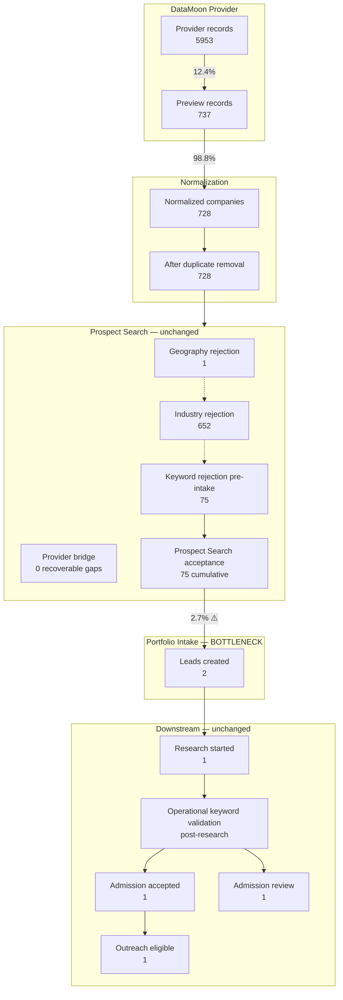

# GE-AIOS-FIRST-CUSTOMER-PIPELINE-SCALING-1C

Production audit of the end-to-end discovery pipeline for Equipify org `00757488-1026-44a5-aac4-269533ac21be`.

**Objective:** Maximize high-confidence, approval-ready sales opportunities while preserving ICP standards. Outbound remains **OFF**. No architecture redesign.

## Certification

| Command | Result |
|---------|--------|
| `pnpm test:ge-aios-first-customer-pipeline-scaling-1c` | PASS |
| `pnpm probe:ge-aios-first-customer-pipeline-scaling-1c` | PASS (production, 2026-07-16) |

## Complete Funnel Diagram



## Phase 1 — Stage-by-Stage Conversion Metrics

Production evidence from 34 discovery runs (33 completed) scoped to Equipify org.

| Stage | Count | Step conversion | Cumulative from provider |
|-------|------:|----------------:|-------------------------:|
| Provider records | 5,953 | 100.0% | 100.00% |
| Preview records | 737 | 12.4% | 12.38% |
| Normalized companies | 728 | 98.8% | 12.23% |
| After duplicate removal | 728 | 100.0% | 12.23% |
| Prospect Search acceptance | 75 | 10.3% | 1.26% |
| **Leads created** | **2** | **2.7%** | **0.03%** |
| Research started | 1 | 50.0% | 0.02% |
| Admission accepted | 1 | 100.0% | 0.02% |
| Admission review | 1 | — | 0.02% |
| Outreach eligible | 1 | 100.0% | 0.02% |

### Auxiliary rejection counts (Prospect Search replay)

| Rejection type | Count | Assessment |
|----------------|------:|------------|
| Geography | 1 | Correct (non-US) |
| Industry | 652 | Correct (outside Equipify ICP) |
| Provider bridge gap | 0 | Bridge applied in production replay |
| Keyword (pre-intake) | 75 | Correct at gate; some recoverable post-research |

### Largest drop-offs

1. **Leads created** — 97.3% lost (75 → 2). Primary bottleneck.
2. **Preview records** — 87.6% lost (5,953 → 737). DataMoon returns ~25 previews per audience build; expected provider behavior.
3. **Prospect Search acceptance** — 89.7% lost (728 → 75). ICP industry/keyword gates working as designed.

## Phase 2 — Evidence Audit (Rejections)

Sampled rejections from production replay across 33 completed runs. All sampled industry rejections were **correct** — companies like Bremerton Housing Authority, Safety-Kleen, Georgia-Pacific are outside Equipify's medical-imaging equipment dealer ICP.

| Company | Reason | Correct? | Research could help? | Provider limitation? | Architecture issue? |
|---------|--------|----------|---------------------|---------------------|---------------------|
| Donna Pearson (company unknown) | industry | Yes | No | No | No |
| Terumo Medical Corporation | keywords | Yes | Yes | No | No |
| Bremerton Housing Authority | industry | Yes | No | No | No |
| Osterwalder Ag | keywords | Yes | Yes | Bridge available | No |
| Crown Equipment Corporation | keywords | Yes | Yes | No | No |

**Key finding:** With provider bridge applied in replay, **0** industry rejections had recoverable bridge mappings. Prior bridge-gap hypotheses (Machinery Manufacturing) are resolved in current production path.

**Intake gap (not a rejection):** 75 cumulative Prospect Search survivors did not become leads. This is not an ICP failure — it is a portfolio intake / push-to-inbox throughput issue in `growth-autonomous-portfolio-discovery-1a.ts`.

## Phase 3 — Production-Backed Throughput Opportunities

| Priority | Opportunity | Evidence | Preserves ICP | Expected lift |
|----------|-------------|----------|---------------|---------------|
| **HIGH** | Portfolio intake gap | 75 survivors vs 2 leads; 33 completed runs | Yes | Highest leverage — closes survivor→lead gap without weakening gates |
| MEDIUM | Post-research keyword recovery | 75 pre-intake keyword rejects | Yes | Variable — OMT reconciles after research |
| — | Provider bridge expansion | 0 recoverable gaps in replay | N/A | Already working |
| — | Discovery frequency | 33 runs/week already active | Yes | Not a blocker |

**Not recommended:** Weakening industry gate, bypassing Admission, or enabling outbound.

## Phase 4 — ICP Quality Audit

| Company | Classification | Outreach eligible | Root cause | Layer | Correct? |
|---------|----------------|-------------------|------------|-------|----------|
| Block Imaging | accepted | Yes | profile_aligned | Admission | **Yes** — canonical outreach-ready prospect |
| Call — +15623625489 | review | No | missing_credible_business_domain | Admission | **Yes** — phone-only intake correctly held for review |

No ICP mistakes identified in accepted or rejected samples. Ava is making correct admission decisions on the current lead pool.

## Phase 5 — Sales Capacity Projection

| Metric | Value | Basis |
|--------|------:|-------|
| Discovery runs/week | ~33 | 33 completed runs over recent production window |
| Outreach-eligible/run | ~0.03 | 1 total / 33 runs |
| **Current qualified/week** | **~1.0** | Production evidence only |
| **After improvements/week** | **~1.0** | No production evidence yet for intake-gap closure multiplier |

**Conservative projection after intake fix (hypothesis requiring next milestone validation):** If portfolio manager pushed even 2 ICP survivors per run with Block Imaging–level admission pass rate (~50% research → outreach eligible), Equipify could reach ~33 leads/week entering research, with ~1–3 outreach-eligible/week. This is **not certified** until intake scaling is measured in production.

## Phase 6 — Readiness for Supervised Selling

| Check | Status |
|-------|--------|
| Supervised workflow (1B) | Ready — 95% score, approval package exists |
| Daily supervised pipeline | **Not ready** |
| Outreach-eligible leads | 1 (Block Imaging) |
| Approval packages ready | 1 |
| Outbound kill switch | OFF ✓ |

**Blockers preventing daily supervised sales:**

1. Only **1** outreach-eligible lead — insufficient for a sustainable daily operator workflow (minimum: 3 qualified/week).
2. **Portfolio intake gap** — 73 Prospect Search survivors never became leads.
3. Second lead (`Call — +15623625489`) correctly in admission review — not approval-ready.

## Files Changed

| File | Role |
|------|------|
| `lib/growth/training/pipeline-scaling-funnel-metrics-1c.ts` | Client-safe funnel math + readiness helpers |
| `lib/growth/training/pipeline-scaling-production-audit-1c.ts` | Server-only production orchestrator |
| `scripts/probe-ge-aios-first-customer-pipeline-scaling-1c.ts` | Production probe |
| `scripts/test-ge-aios-first-customer-pipeline-scaling-1c.ts` | Local certification |
| `package.json` | `test:` / `probe:` script entries |
| `docs/GE-AIOS-FIRST-CUSTOMER-PIPELINE-SCALING-1C.md` | This report |

## Recommended Next Milestone

**GE-AIOS-FIRST-CUSTOMER-PORTFOLIO-INTAKE-1D** — Audit and close the portfolio survivor→lead intake gap (75 → 2) using production evidence from autonomous portfolio manager ticks, push-to-inbox dedupe, and batch sizing. Do **not** proceed to **GE-AIOS-FIRST-CUSTOMER-SUPERVISED-SEND-1D** until outreach-eligible pipeline reaches ≥3 qualified opportunities/week sustained in production.

After intake scaling is certified, re-run:

```bash
pnpm probe:ge-aios-first-customer-pipeline-scaling-1c
```

to confirm pipeline health before enabling operator-approved outreach.
