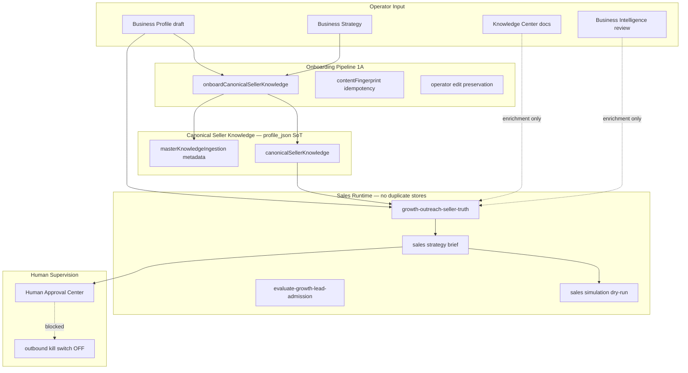

# GE-AIOS-FIRST-CUSTOMER-SALES-READINESS-1A

Equipify is the first fully trained customer of the AI OS. This milestone delivers the **canonical customer onboarding/training pipeline** that any future organization can use — Equipify is simply the first populated instance.

## Knowledge Architecture



**Single source of truth:** `growth.organization_business_profiles.profile_json` (Approved Business Profile).

## Phase 1 — Knowledge Completeness Audit

Run: `pnpm test:ge-aios-first-customer-sales-readiness-1a`

| Domain | Status (Equipify) | Canonical Location |
|--------|-------------------|-------------------|
| Company identity | Present | `profile_json.company`, `canonicalSellerKnowledge.company` |
| Products | Present | `profile_json.company.productsServices`, `canonicalSellerKnowledge.products` |
| Capabilities / feature matrix | Present | `canonicalSellerKnowledge.products.modules`, `lib/plans.ts` |
| Supported industries | Present | `profile_json.idealCustomers.targetIndustries` |
| Supported service verticals | Present | `profile_json.idealCustomers.supportedServiceVerticals`, `supported-service-verticals.ts` |
| ICP | Present | `profile_json.idealCustomers`, admission gate |
| Buyer personas | Present | `canonicalSellerKnowledge.personas` |
| Qualification criteria | Present | `profile_json.salesAndMarketing.qualificationCriteria` |
| Disqualification rules | Present | `idealCustomers.disqualifiers`, `company.whenNotToRecommend` |
| Pricing philosophy | Present | `canonicalSellerKnowledge.commercial`, `businessStrategy.positioning` |
| Competitive differentiators | Present | `canonicalSellerKnowledge.company.differentiators` |
| Positioning | Present | `businessStrategy.messaging.elevatorPitch` |
| Objection handling | Present | `businessStrategy.objections`, persona objections |
| Messaging | Present | `salesAndMarketing.messagingAngles`, `businessStrategy.messaging` |
| Brand voice | Present | `businessStrategy.messaging.tone`, `wordsToAvoid`, `neverSay` |
| Case studies / proof | Present | `canonicalSellerKnowledge.proof` |
| Implementation | Present | `canonicalSellerKnowledge.commercial` |
| Onboarding | Present | `canonicalSellerKnowledge.commercial.onboardingApproach` |
| Integrations | Present | `canonicalSellerKnowledge.products.modules` |
| FAQs | Partial | Knowledge Center (`signal_events`) — no dedicated FAQ schema |
| Terminology / glossary | Present | `canonicalSellerKnowledge.industries[].operationalTerminology` |
| Operational workflows | Present | `problemsAndTriggers`, `discovery` |
| Sales playbooks | Present | `businessStrategy`, conversational playbooks |

**Gaps (non-blocking):** Structured pricing tiers/SKUs, dedicated FAQ schema, Teaching Sessions UI (coming soon).

## Phase 2 — Canonical Seller Knowledge Model

**File:** `lib/growth/business-profile/canonical-seller-knowledge-types.ts`

Organization-agnostic types: `CanonicalSellerKnowledge`, `SellerCapabilityKnowledge`, `SellerIndustryKnowledge`, etc.

Equipify seed data lives in `equipify-master-knowledge-canonical.ts` and is injected via `equipify-canonical-seller-knowledge-seed-1a.ts` — not hardcoded in the pipeline.

## Phase 3 — Knowledge Ingestion

**File:** `lib/growth/training/canonical-seller-knowledge-onboarding-1a.ts`

- Idempotent via `contentFingerprint`
- Never overwrites operator-authored fields
- Tracks provenance in `masterKnowledgeIngestion`
- Merges: approved profile, master knowledge seed, SSV registry, website hints

## Phase 4 — Seller Readiness Certification

**File:** `lib/growth/training/canonical-seller-knowledge-readiness-1a.ts`

13 readiness checks → `readinessScore` (0–1) → `supervisedSellingAllowed` when score ≥ 0.75 and no critical blockers.

## Phase 5 — Sales Simulation

**File:** `lib/growth/training/canonical-seller-knowledge-sales-simulation-1a.ts`

5 ICP scenarios (3 qualified, 2 disqualified). Produces approval-ready packages. **Does not send.**

## Phase 6 — Gap Analysis / Blockers

| Severity | Blocker | Equipify Status |
|----------|---------|-----------------|
| Critical | Missing approved profile | Resolved |
| Critical | Missing canonical seller knowledge | Resolved |
| High | Incomplete service verticals | Resolved (27/27) |
| Medium | Knowledge domain gaps | 0 missing domains |
| Low | Explicit objection pairs in strategy | May need operator refinement |

**Outbound:** `autonomy_outbound_enabled=false` — unchanged.

## Phase 7 — Future Customer Readiness

The same onboarding pipeline works for: HVAC, Medical equipment, Fire & Security, Locksmith, Property Management, Commercial Kitchen, Calibration, Garage Door, Appliance Repair — validated via `FUTURE_CUSTOMER_VERTICAL_SMOKE_TESTS` against `SUPPORTED_SERVICE_VERTICALS_REGISTRY`.

Future orgs supply their own `CanonicalSellerKnowledgeSeedProvider`; Equipify is the reference implementation.

## Files Changed

| File | Purpose |
|------|---------|
| `lib/growth/business-profile/canonical-seller-knowledge-types.ts` | Generic seller knowledge model |
| `lib/growth/business-profile/equipify-master-knowledge-types.ts` | Equipify aliases atop generic types |
| `lib/growth/business-profile/equipify-master-knowledge-canonical.ts` | Added `salesPhilosophyPrinciples` |
| `lib/growth/training/canonical-seller-knowledge-audit-1a.ts` | Knowledge completeness audit |
| `lib/growth/training/canonical-seller-knowledge-onboarding-1a.ts` | Idempotent onboarding pipeline |
| `lib/growth/training/canonical-seller-knowledge-readiness-1a.ts` | Seller readiness certification |
| `lib/growth/training/canonical-seller-knowledge-sales-simulation-1a.ts` | Supervised sales simulation |
| `lib/growth/training/equipify-canonical-seller-knowledge-seed-1a.ts` | Equipify seed provider |
| `scripts/test-ge-aios-first-customer-sales-readiness-1a.ts` | Milestone certification |
| `package.json` | `test:ge-aios-first-customer-sales-readiness-1a` |

## Success Criteria

Ava can:

- [x] Identify the correct ICP (admission gate + seller truth)
- [x] Explain Equipify without hallucination (guardrails + limitations + never-say)
- [x] Recommend the correct product tier (packaging philosophy + capabilities)
- [x] Explain why the customer should care (elevator pitch + differentiators)
- [x] Generate approval-ready outreach (sales strategy brief + simulation)
- [x] Support supervised sales workflow (human approval, outbound disabled)

## Recommended Next Milestone

**GE-AIOS-FIRST-CUSTOMER-SUPERVISED-SALES-1B** — Run live supervised sales cycles with real ICP leads: discovery → research → qualification → human-approved outreach packages, using production Equipify profile with outbound still gated.

## Certification

```bash
pnpm test:ge-aios-first-customer-sales-readiness-1a
```
