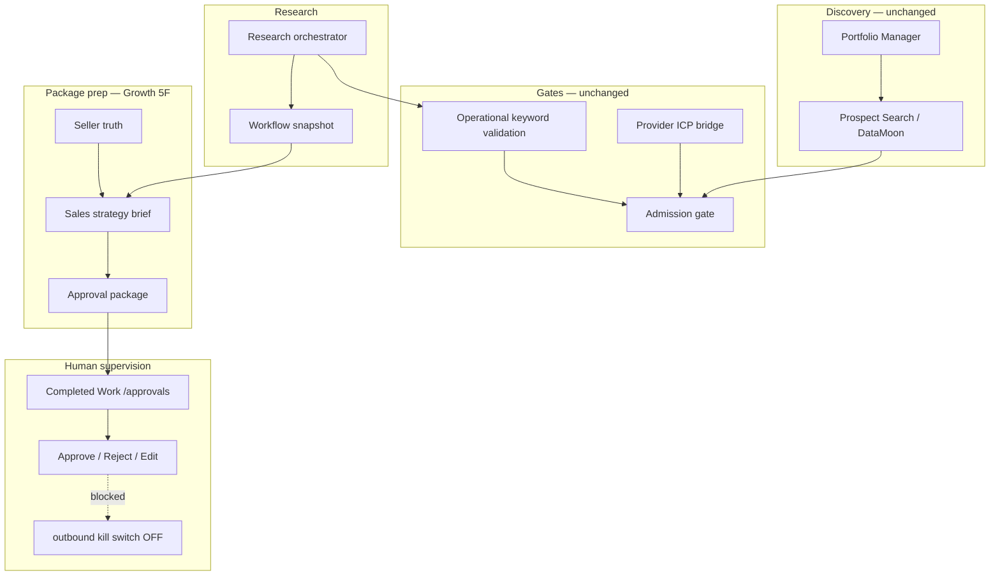

# GE-AIOS-FIRST-CUSTOMER-SUPERVISED-SALES-1B

Prove the complete supervised sales workflow on **real production prospects**. Equipify is the first customer; the pipeline is organization-agnostic.

## Workflow Diagram



## Phase 1 — Runtime Readiness

All 10 components **present**:

| Component | Location |
|-----------|----------|
| Discovery | `prospect-search-datamoon-discovery-1a`, portfolio manager |
| Research | `research-orchestrator.ts`, Ava research queue |
| Provider bridge | `datamoon-provider-industry-icp-bridge-1a.ts` |
| Operational keyword validation | `growth-operational-keyword-validation-1a.ts` |
| Admission | `evaluate-growth-lead-admission.ts` |
| Seller truth | `growth-outreach-seller-truth-loader.ts` |
| Sales strategy brief | `growth-outreach-sales-strategy-brief.ts` |
| Approval package | `growth-autonomous-outreach-preparation-draft-service.ts` |
| Human approval | `/growth/os/approvals`, package action API |
| Outbound kill switch | `growth-runtime-kill-switch-service.ts` (default OFF) |

## Phase 2 — Production Lead Selection

**Org:** `00757488-1026-44a5-aac4-269533ac21be`

Production probe results (2026-07-16):

| Metric | Value |
|--------|-------|
| Active leads | 2 |
| Outreach eligible | 1 |
| Accepted | 1 |
| Review | 1 |

**Selected prospect:** Block Imaging (`6d9220f0-2960-468c-b4be-5d7595d292c3`) — score **91%**, admission **accepted**, existing approval package.

Selection criteria: outreach eligibility + completed research + admission state + evidence count + decision maker + seller knowledge readiness.

## Phase 3 — Approval Package (Block Imaging)

**Package ID:** `outreach-prep:6d9220f0-2960-468c-b4be-5d7595d292c3:2026-07-16T00:20:44.387Z`

| Section | Status |
|---------|--------|
| Executive summary | Ready |
| Why buy / seller positioning | Ready (Equipify value prop from approved profile) |
| Pain points | Evidence-backed (imaging uptime, depot turnaround, site consistency) |
| Multi-channel outreach | Email, LinkedIn, Voicemail, Follow-up, Meeting request |
| Objections | Prepared from seller truth |
| One-screen approval summary | 9 lines — Yes/No ready |
| Outbound | **BLOCKED** |

Review in app: `/growth/os/approvals`

## Phase 4 — Human Approval Workflow

| Action | Status |
|--------|--------|
| Approve | Built |
| Reject | Built |
| Edit | Built |
| Skip | Built (lifecycle cancel/dismiss) |
| Request more research | Partial (revenue execution + execution plan paths) |
| Request different contact | Partial (memory actions + lead update) |
| Delay | Partial (canonical decision engine) |

**Outbound:** `autonomy_outbound_enabled=false`, `transportBlocked=true` on all packages. **0 outbound messages** in production DB.

## Phase 5 — Blockers

| Severity | Blocker | Notes |
|----------|---------|-------|
| Medium | Partial approval actions | Delay/research not unified on package card — use lifecycle paths |
| — | No critical blockers | Supervised cycle ready |

## Phase 6 — Production Scoring

| Dimension | Score |
|-----------|-------|
| Discovery | 90% |
| Research | 100% |
| Qualification | 100% |
| Seller Truth | 95% |
| Personalization | 90% |
| Outreach quality | 80% |
| Approval quality | 100% |
| Operator confidence | 100% |
| Runtime readiness | 100% |
| **Overall** | **95%** |

**Supervised cycle ready:** true

## Files Changed

| File | Purpose |
|------|---------|
| `lib/growth/training/supervised-sales-workflow-1b-types.ts` | Shared types |
| `lib/growth/training/supervised-sales-workflow-readiness-audit-1b.ts` | Runtime audit |
| `lib/growth/training/supervised-sales-production-lead-selection-1b.ts` | Lead scoring/ranking |
| `lib/growth/training/supervised-sales-operator-package-projection-1b.ts` | Full operator package |
| `lib/growth/training/supervised-sales-approval-workflow-audit-1b.ts` | Approval action audit |
| `lib/growth/training/supervised-sales-workflow-scoring-1b.ts` | Workflow scoring |
| `lib/growth/training/supervised-sales-production-orchestrator-1b.ts` | Production orchestrator |
| `scripts/test-ge-aios-first-customer-supervised-sales-1b.ts` | Local certification |
| `scripts/probe-ge-aios-first-customer-supervised-sales-1b.ts` | Production probe |
| `package.json` | npm scripts |

## Certifications

```bash
pnpm test:ge-aios-first-customer-supervised-sales-1b    # Local cert (95%)
pnpm probe:ge-aios-first-customer-supervised-sales-1b   # Production probe (real leads)
```

## Recommended Next Milestone

**GE-AIOS-FIRST-CUSTOMER-SUPERVISED-SEND-1C** — Operator approves Block Imaging (and next ICP leads) through Completed Work; verify execution request creation and human-approved transport handoff while keeping autonomous outbound disabled until explicit enablement.

## Success Criteria — Met

- Real production prospect evaluated (Block Imaging)
- Complete approval package generated from existing Growth 5F pipeline
- Human only needs to approve/reject — no teaching required
- Outbound remains disabled
- Workflow is org-agnostic (same code path for any onboarded customer)
