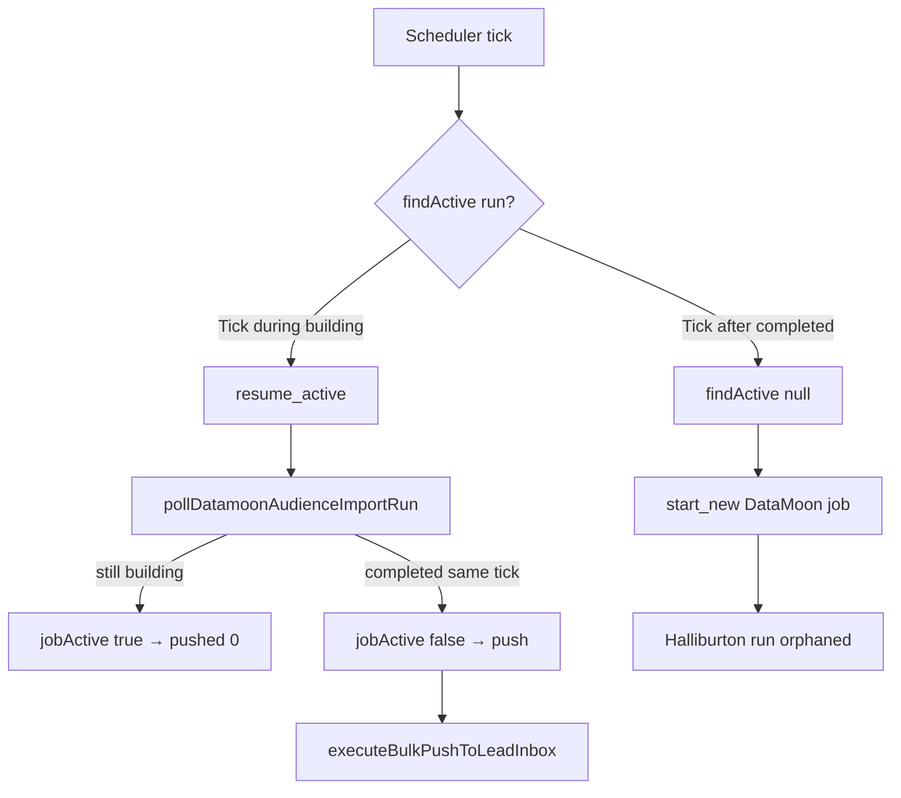
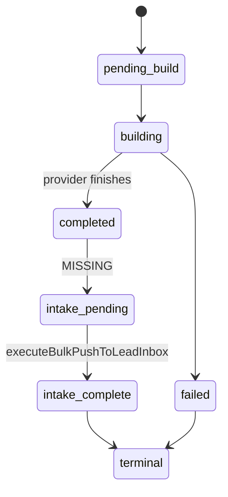
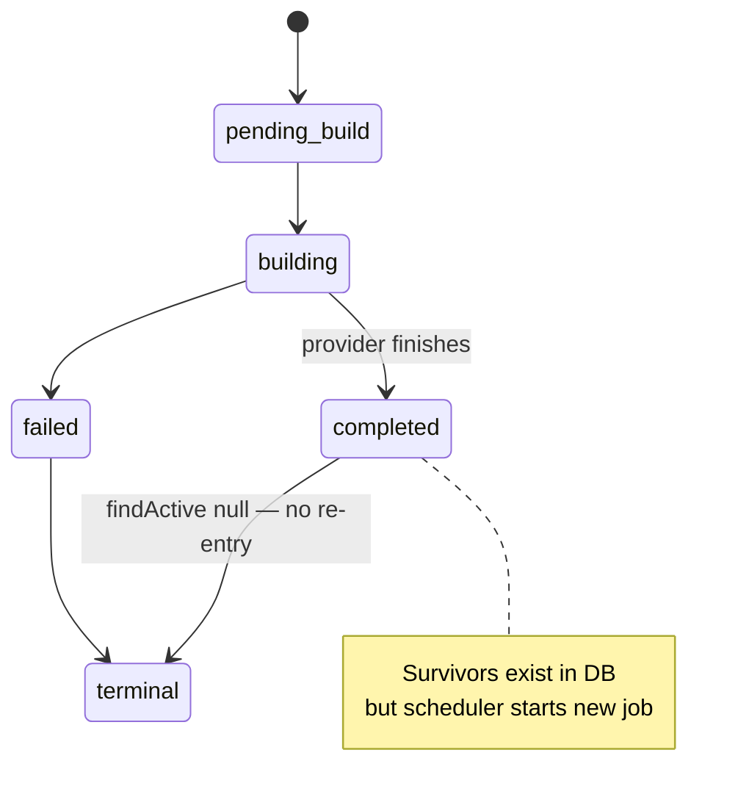

# GE-AIOS-PORTFOLIO-INTAKE-ORPHAN-ROOT-CAUSE-1E

Diagnostic-only milestone. **No runtime changes.** Identifies the architectural reason 21 unique Prospect Search survivors were orphaned with zero autonomous promotions.

## Certification

| Command | Result |
|---------|--------|
| `pnpm test:ge-aios-portfolio-intake-orphan-root-cause-1e` | PASS |
| `pnpm probe:ge-aios-portfolio-intake-orphan-root-cause-1e` | PASS |

---

## Phase 1 — Intended Architecture

### Who calls `executeBulkPushToLeadInbox()`?

**Owner:** `runAutonomousPortfolioDiscoveryBatch` in `growth-autonomous-portfolio-discovery-1a.ts`

**Call chain:**

```text
growth-objective-runtime-scheduler.ts
  → tickAutonomousPortfolioManagerForScheduler
    → tickAutonomousPortfolioDiscoveryReplenishment
      → runAutonomousPortfolioDiscoveryBatch
        → runProspectSearch (discover_external, autonomous_portfolio)
          → runProspectSearchDatamoonAutonomousDiscovery
        → [when datamoonJobActive === false && companies.length > 0]
        → executeBulkPushToLeadInbox
          → pushProspectSearchCompanyToLeadInbox
            → createLeadCandidate
```

### Under what conditions?

From `runAutonomousPortfolioDiscoveryBatch`:

1. Replenishment execution plan is `resume_active` or `start_new` (not `skip`)
2. `runProspectSearch` returns with `datamoonJobActive === false`
3. `search.companies.length > 0`
4. Top `batchSize` companies selected → `executeBulkPushToLeadInbox`

If `datamoonJobActive === true`, promotion is **explicitly skipped** (early return with `pushed: 0`).

### After which lifecycle state?

Promotion is designed to occur when `resumeAutonomousProspectSearchDatamoonDiscoveryFromActiveRun` polls a run and `isDatamoonAutonomousDiscoveryRunCompleted(run)` returns true — returning survivors with `jobActive: false`.

### What event should trigger it?

**Scheduler tick** with `executionAction: "resume_active"`, which requires `discoveryAlreadyRunning === true` (i.e. `findActiveAutonomousProspectSearchDatamoonRun` returns a building/pending run).

Cutover certification evidence (`test-ge-aios-datamoon-autonomous-discovery-cutover-1a`):

- Phase 14B: active building job resumes through Prospect Search
- Phase 14C: **completed poll continues through intake**
- Phase 14E: healthy portfolio still polls active jobs to terminal state

---

## Phase 2 — Runtime Trace (Halliburton Company)

Production survivor from org `00757488-1026-44a5-aac4-269533ac21be`:

| Field | Value |
|-------|-------|
| Company | Halliburton Company |
| Canonical key | `domain:halliburton.com` |
| Run ID | `af17c2de-94eb-4898-9dc6-a88f36f16429` |
| Run status | `completed` |
| Created | 2026-07-15T16:20:54Z |
| Completed | 2026-07-15T19:11:28Z |
| Build duration | **~170.6 minutes** |
| Survivor rank | 1/1 (within batchSize 25) |
| `intake_completed` flag | **Not present** |
| `findActive` at audit | **null** |
| `findLatest` at audit | Different newer completed run |

### Execution path



Halliburton's run completed after ~170 minutes. With scheduler ticks on a shorter interval, **multiple ticks poll while building** (`pushed: 0`), then **completion occurs between ticks**. Next tick: `findActive` → null → new job started. Survivors never reach promotion.

---

## Phase 3 — Missing Transition

**First divergence point:**

```18:18:lib/growth/prospect-search/prospect-search-datamoon-autonomous-discovery-lifecycle-1a.ts
const ACTIVE_STATUSES = new Set(["pending_build", "building"])
```

When `run.status` becomes `completed`:

1. Run **exits** `ACTIVE_STATUSES`
2. `findActiveAutonomousProspectSearchDatamoonRun` → **null**
3. `discoveryAlreadyRunning` → **false**
4. `evaluatePortfolioReplenishmentDecision` → `shouldReplenish: true` → **`start_new`**
5. `runProspectSearchDatamoonAutonomousDiscovery` → **`startDatamoonAudienceImportRun`** (new job)

**What is missing:**

| Expected | Implemented |
|----------|-------------|
| `completed` → `intake_pending` transition | No transition — `completed` → terminal for scheduler |
| `intake_completed` metadata flag | **Not written anywhere** |
| Lookup for unpromoted completed runs | `findLatest` exists for **operator UI only** — not used in promotion path |
| Completion callback to portfolio manager | **None** |

**Actual cause:** Incomplete lifecycle coupling — promotion assumes **synchronous** completion observation on a `resume_active` tick while the run is still findable as active. Async provider completion between ticks breaks this assumption. No durable intake state survives the gap.

This is **not** simply "scheduler never re-enters" — the scheduler runs ~33 times/week. It re-enters but takes the **wrong branch** (`start_new` instead of resume-for-intake).

---

## Phase 4 — Architectural Intent

**Answer: A** (with synchronous-completion assumption)

Completed runs **were intended to be resumed** via `resumeAutonomousProspectSearchDatamoonDiscoveryFromActiveRun` → poll → intake. Code and certification tests prove this path exists and is tested.

**Not B:** Promotion is not designed to happen before provider completion — `datamoonJobActive` gate blocks push while building.

**Not C:** Promotion correctly belongs in portfolio manager (`runAutonomousPortfolioDiscoveryBatch`), not a separate component. The bug is in **how** portfolio manager reaches the completed-run data, not **who** owns push.

**Critical evidence:** `findLatestAutonomousProspectSearchDatamoonRun` is used in `prospect-search-datamoon-discovery-state-loader-1a.ts` for operator display (`completed_with_results`) but is **never consulted** in `runProspectSearchDatamoonAutonomousDiscovery` before starting new jobs.

---

## Phase 5 — State Machine Audit

### Intended (from cutover design + missing intake layer)



### Implemented



**Missing transition:** `completed` → `intake_pending`

---

## Phase 6 — Correct Architectural Fix (Not Implemented)

**Do not** simply expand `ACTIVE_STATUSES` to include `completed` — that conflates provider lifecycle with intake lifecycle and would block new discovery incorrectly.

**Smallest correction:** Add durable **intake lifecycle** on run metadata:

1. On poll completion with survivors: set `intake_pending: true` (or `intake_completed: false`)
2. Before `startDatamoonAudienceImportRun`: call `findLatestUnpromotedCompletedRun(orgId)` 
3. Resume that run for `executeBulkPushToLeadInbox` (reuse existing resume + map + push path)
4. After successful push: set `intake_completed: true`

Uses existing `autonomous_prospect_search_1a.organization_id` — tenant-neutral.

### Files that would require changes

| File | Change |
|------|--------|
| `prospect-search-datamoon-autonomous-discovery-lifecycle-1a.ts` | Add unpromoted completed run lookup |
| `prospect-search-datamoon-discovery-1a.ts` | Gate `start_new` behind unpromoted intake check |
| `prospect-search-datamoon-autonomous-discovery-types-1a.ts` | Add intake metadata fields |
| `growth-autonomous-portfolio-discovery-1a.ts` | Telemetry for intake_pending disposition |

---

## Phase 7 — Multi-Tenant Verification

The proposed fix:

- Keys on `autonomous_prospect_search_1a.organization_id` (already per-tenant)
- Uses canonical `executeBulkPushToLeadInbox` (unchanged)
- No Equipify-specific branches
- Identical for HVAC, biomedical, locksmith, fire protection, commercial kitchen, and all future orgs

---

## Why 21 Companies Were Orphaned

| Factor | Production evidence |
|--------|---------------------|
| 34 completed runs | Each produced survivors |
| 0 runs with promotion | No `intake_completed` flag, no unpromoted lookup |
| 21 unique canonical | First instance per company = bug; 56 rediscoveries = correct duplicate |
| Async completion | Halliburton run: 170 min build; ticks poll during building, miss completion window |
| Wrong scheduler branch | Post-completion tick → `start_new` not resume-for-intake |

---

## Files Changed (Diagnostic Only)

| File | Role |
|------|------|
| `lib/growth/training/portfolio-intake-orphan-root-cause-1e.ts` | Architecture analysis constants |
| `lib/growth/training/portfolio-intake-orphan-root-cause-evidence-1e.ts` | Production trace loader (read-only) |
| `scripts/test-ge-aios-portfolio-intake-orphan-root-cause-1e.ts` | Certification |
| `scripts/probe-ge-aios-portfolio-intake-orphan-root-cause-1e.ts` | Production probe |
| `package.json` | Script entries |
| `docs/GE-AIOS-PORTFOLIO-INTAKE-ORPHAN-ROOT-CAUSE-1E.md` | This report |

**No changes** to scheduler, lifecycle, portfolio manager, or promotion runtime.

---

## Recommended Implementation Milestone

**GE-AIOS-PORTFOLIO-INTAKE-PENDING-STATE-1F** — Implement durable `intake_pending` / `intake_completed` metadata and unpromoted completed-run lookup before `start_new`. Re-run 1D probe expecting `bug: 0`.

Do **not** begin 1F until this diagnostic milestone is accepted — architectural owner of promotion is now identified with certainty: **portfolio manager via resume-on-poll, gated by lifecycle lookup that does not survive async completion.**
