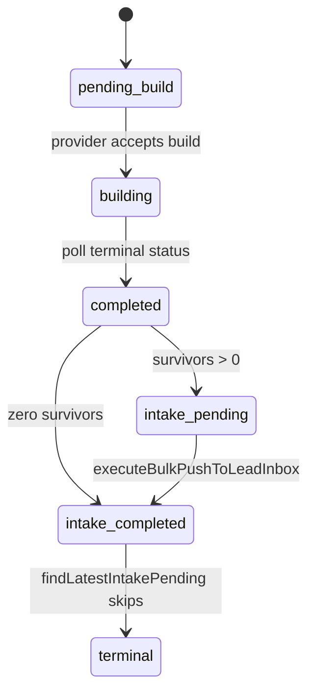

# GE-AIOS-PORTFOLIO-INTAKE-PENDING-STATE-1F

Durable intake lifecycle so every qualified Prospect Search survivor receives exactly one disposition, including when provider completion occurs between scheduler ticks.

## Lifecycle diagram



## State transition table

| From | To | Trigger | Owner |
|------|-----|---------|-------|
| `pending_build` | `building` | DataMoon accepts audience build | Prospect Search (provider only) |
| `building` | `completed` | Provider poll observes completion | Prospect Search (provider only) |
| `completed` | `intake_pending` | `markAutonomousRunIntakePending` when survivors > 0 | Metadata witness |
| `completed` | `intake_completed` | Zero survivors after filters | Metadata witness |
| `intake_pending` | `intake_completed` | Portfolio batch push + terminalize | Portfolio Manager |
| `intake_completed` | terminal | Scheduler skips run | Portfolio Manager |

## Idempotency design

| Layer | Mechanism |
|-------|-----------|
| Survivor promotion | `createLeadCandidate` dedupe_hash — retries yield `already_exists` |
| Run terminalization | `intake_completed` on run metadata — subsequent ticks skip via `findLatestIntakePending` |
| Intake witness | `intake_pending` set on completion with survivors; legacy completed runs without flag remain eligible until `intake_completed` |
| Concurrent ticks | Lead dedupe + `intake_promotion_started_at` + `intake_completed` make batch exactly-once at run level |

## Ownership

```
Portfolio Manager
  → runAutonomousPortfolioDiscoveryBatch
  → executeBulkPushToLeadInbox
  → Unified Intake
  → Admission
```

Prospect Search never owns promotion — it only produces survivors and sets durable intake metadata witnesses.

## Certification

```bash
pnpm test:ge-aios-portfolio-intake-pending-state-1f
pnpm probe:ge-aios-portfolio-intake-pending-state-1f
pnpm probe:ge-aios-first-customer-portfolio-intake-1d
pnpm probe:ge-aios-first-customer-pipeline-scaling-1c
```

## Remaining blockers

1. **Multi-batch single-run cursor** — runs with more survivors than replenish batch size need promotion offset tracking (separate milestone).
2. **Production scheduler tick** — legacy orphans reclassified as `waiting_for_scheduler` immediately; lead promotion requires live autonomous portfolio tick after deploy.

## Files changed

- `lib/growth/prospect-search/prospect-search-datamoon-intake-lifecycle-1f.ts` (new)
- `lib/growth/prospect-search/prospect-search-datamoon-autonomous-discovery-types-1a.ts`
- `lib/growth/prospect-search/prospect-search-datamoon-autonomous-discovery-lifecycle-1a.ts`
- `lib/growth/prospect-search/prospect-search-datamoon-discovery-1a.ts`
- `lib/growth/prospect-search/prospect-search-repository.ts`
- `lib/growth/portfolio-manager/growth-autonomous-portfolio-manager-1a-types.ts`
- `lib/growth/portfolio-manager/growth-autonomous-portfolio-discovery-1a.ts`
- `lib/growth/training/portfolio-intake-survivor-loader-1d.ts`
- `lib/growth/training/portfolio-intake-survivor-classification-1d.ts`
- `lib/growth/training/portfolio-intake-production-audit-1d.ts`
- `lib/growth/training/portfolio-intake-pending-state-1f.ts` (new)
- `lib/growth/training/portfolio-intake-pending-state-evidence-1f.ts` (new)
- `scripts/test-ge-aios-portfolio-intake-pending-state-1f.ts` (new)
- `scripts/probe-ge-aios-portfolio-intake-pending-state-1f.ts` (new)
- `package.json`
