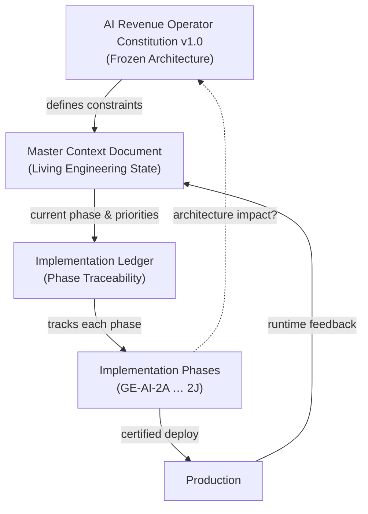

# GE-DOC-1 — Documentation Foundation

**Phase:** GE-DOC-1  
**Status:** Complete  
**Date:** 2026-06-25  
**Type:** Read-only documentation reorganization (no code, no runtime changes)

---

## Executive summary

The Growth Engine architecture phase (GE-AI-1X) produced a complete constitutional design for the **AI Revenue Operator** — agents, decisions, memory, operating system, governance, and binding schemas. That knowledge had been mixed into the monolithic Master Context Document (~426KB manual sections) alongside live engineering state, certifications, and product inventory.

**GE-DOC-1 separates concerns into three canonical documents** so future engineers never infer architectural intent from stale chat logs or duplicated master-context sections.

| Document | Role | Change frequency |
|----------|------|------------------|
| **Constitution v1.0** | Permanent architecture | Rare (amendments only) |
| **Master Context Document** | Living engineering state | Every sprint / cert |
| **Implementation Ledger** | Phase traceability | Every GE-AI-2X phase |

This marks the official transition from **Architecture Phase (GE-AI-1X)** to **Engineering Phase (GE-AI-2X)**.

---

## Documentation relationships



### Purpose of each document

**Constitution v1.0** (`docs/architecture/AI_REVENUE_OPERATOR_CONSTITUTION_v1.0.md`)  
Answers: *What is the system? What are the permanent rules?*  
Contains vision, agent roster, decision/memory/OS models, invariants, glossary, contracts, governance, amendment process. Does **not** track sprint status or file paths.

**Master Context Document** (`docs/MASTER_CONTEXT_DOCUMENT.md`)  
Answers: *What is the team building right now? What is production doing?*  
Contains current phase, env/dev/commit/deploy rules, certifications, runtime state, risks, priorities, and pointers to legacy inventory scans. References the Constitution; does not duplicate it.

**Implementation Ledger** (`docs/AI_REVENUE_OPERATOR_IMPLEMENTATION_LEDGER.md`)  
Answers: *Which constitutional sections did each phase implement? What changed?*  
One entry per GE-AI-2X phase: files, migrations, commits, certs, rollback, dependencies.

---

## Constitutional freeze (v1.0)

The following are **frozen** as of Constitution v1.0 (2026-06-25):

| Frozen element | Notes |
|----------------|-------|
| Agent hierarchy | 16 agents + Executive Brain |
| Decision hierarchy | GE-AI-1B lifecycle; one owner per key |
| Memory hierarchy | 24 types; data → memory → knowledge → wisdom |
| Operating model | Work Orders, 5-min executive loop, interrupts |
| Autonomy model | Levels 0–5; GE-AUTO binding |
| Priority model | Single formula; legacy engines as feeders |
| Governance model | Compliance veto; operator override rules |
| Implementation contracts | Work Order, Decision Record, component must/must-not |
| Canonical glossary | Mission/Objective, Work Order, Decision, etc. |
| Architectural invariants | 19 permanent laws |

**Changes require a Constitutional Amendment** (Section 20 of the Constitution). Engineering-only changes (UI polish, performance, bug fixes within existing contracts) do not require amendment.

---

## Development process (permanent lifecycle)

### Previous workflow

```
Audit → Implement → Certify → Commit → Deploy
```

### New workflow (GE-AI-2X and constitutional work)

```
Constitution
  ↓
Implementation Phase (GE-AI-2X)
  ↓
Implementation Certification
  ↓
Master Context Update
  ↓
Commit
  ↓
Production Certification
  ↓
Architecture Impact Review
       ↓                    ↓
   No Impact          Architecture Impact
       ↓                    ↓
   Continue         Constitutional Amendment
                           ↓
                       Continue
```

Non-constitutional product work may use a lighter path, but **must not violate frozen invariants**.

---

## Traceability rules

Every GE-AI-2X implementation phase must produce or update:

1. **Constitution section references** — listed in Ledger entry  
2. **Engineering phase ID** — GE-AI-2X  
3. **Implementation certification report** — script or manual cert  
4. **Production certification** — when deployed  
5. **Master Context update** — phase status, risks, runtime state  
6. **Implementation Ledger update** — files, migrations, commits, rollback  

Nothing in GE-AI-2X should ship without this chain.

---

## Constitutional amendment process

### When required

- New/retired agent  
- Decision owner change  
- Invariant or schema change (Work Order, Decision Record)  
- New memory type or retention policy change  
- Scale tier / multi-product architecture  

### Amendment format

```
ID:          GE-AI-{major}G-A{number}
Title:       Short name
Description: What changes
Affected Sections: Constitution §…
Reason:      Why now
Backward Compatibility: Migration / shim plan
Approval:    Lead architect + operator sponsor
Version:     e.g. 1.0 → 1.1
Status:      draft | ratified | superseded
```

### Example (template)

| Field | Example |
|-------|---------|
| ID | GE-AI-2G-A1 |
| Title | Add 17th Agent: Partner Channel Agent |
| Affected Sections | §6, §12, §18 |
| Reason | Partner-led revenue motion |
| Backward Compatibility | Optional agent; default off |
| Approval | Pending |
| Version | 1.0 → 1.1 |
| Status | draft |

Ratified amendments live in `docs/architecture/amendments/` and update Constitution version history.

---

## How future engineers should use these documents

1. **Starting any GE-AI-2X task** — Read Constitution sections cited in the Ledger entry for that phase. Confirm scope matches frozen contracts.  
2. **During implementation** — Update Ledger (files, migrations) as you go. Do not expand scope into frozen areas without amendment.  
3. **At certification** — Record cert verdict in Ledger and Master Context.  
4. **After deploy** — Production cert + architecture impact review. If impact → amendment before continuing dependent phases.  
5. **For product/debug context** — Master Context + legacy `lib/admin/master-context.*` inventory; not Constitution.  
6. **For "why did we decide X?"** — Constitution + Amendment log; not chat history.

---

## Preventing architectural drift

- **Single source of truth** for architecture: Constitution only.  
- **Master Context banner** declares Constitution frozen and points to canonical path.  
- **Ledger** forces explicit constitutional section mapping per phase.  
- **Impact review** after production cert catches drift before it compounds.  
- **Amendments** are versioned, reviewed, and backward-compatibility documented.

---

## Integration with existing repo artifacts

| Artifact | Relationship after GE-DOC-1 |
|----------|----------------------------|
| `lib/admin/master-context.manual.before.md` | Retains module inventory, GE-AUTO detail, API summary; architectural duplication should migrate to Constitution references over time |
| `lib/admin/master-context.manual.after.md` | Status sections mirrored/summarized in Master Context Document |
| `pnpm update:master-context` | Still regenerates inventory; engineers should treat `docs/MASTER_CONTEXT_DOCUMENT.md` as canonical for AI Revenue Operator engineering state |
| `docs/GROWTH_*.md` | Historical phase docs; new work traces through Ledger |

**Note:** GE-DOC-1 created canonical docs under `docs/` without modifying application code or runtime behavior.

---

## Success criteria (met)

- [x] Permanent AI Revenue Operator Constitution v1.0  
- [x] Clean Master Context Document focused on engineering  
- [x] Implementation Ledger for GE-AI-2A through 2J  
- [x] Documentation relationships diagram  
- [x] Constitutional freeze documented  
- [x] Updated development lifecycle  
- [x] Traceability and amendment processes defined  

**GE-AI-2A may begin** when engineering assigns implementation ownership and opens the first Ledger update.

---

*GE-DOC-1 Documentation Foundation — 2026-06-25*
