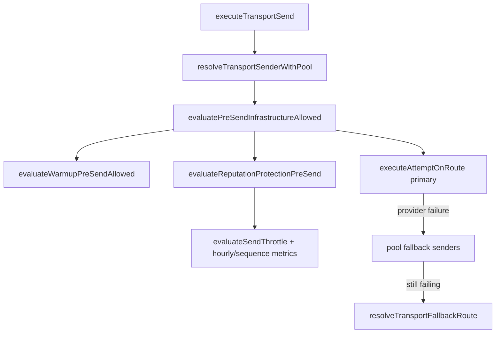

# Growth Deliverability & Warmup Production Hardening (Phase 6.35B)

QA marker: `growth-deliverability-production-hardening-v1`

## Scope

Production hardening for native Gmail and Microsoft 365 mailboxes on the **existing** transport, warmup, reputation, and sender-pool planes. No new transport features, sequence architecture changes, or inbox/attribution/coaching/memory/NBA modifications.

## Hardening shipped in 6.35B

| Area | Change |
|------|--------|
| Infrastructure readiness | `resolveWarmupReadiness()` reports **live** (or simulated when `GROWTH_TRANSPORT_SIMULATE=true`) — aligns ops catalog with enforced pre-send + cron behavior |
| Pre-send reputation | Hourly cap + sequence concurrency wired via `countSenderSendsLastHour` / `countActiveSequenceEnrollmentsForSender` |
| Soft throttles | `caution` / `high_risk` / `unsubscribe_spike` now **hard-block** at pre-send (dashboard throttle engine remains advisory for consoles) |
| Operational health | `computeMailboxOperationalHealth` uses real `warmup_profiles.warmup_progress` (not fixed 50%) |
| Pool failover | Transport retries ranked **pool fallback senders** on provider failure before alternate **routes** on same sender |

## Architecture (send path)



## Preconditions for production volume

Both Gmail and Microsoft mailboxes share the same guards. Safe production volume requires:

1. **Warmup profile** in `warming` or `active` (not `new` / `paused` / `throttled`)
2. **Daily + hourly caps** respected (warmup schedule + `mailbox_send_policies`)
3. **Reputation tier** not `paused` / `protected` / `high_risk` with active soft-throttle rules
4. **Webhooks** configured for bounce/complaint ingestion (Google Pub/Sub, Microsoft Graph subscriptions) — without them, pause thresholds lag
5. **OAuth live** for provider family (`resolveMailboxProviderReadiness`)
6. **Human-approved sends** only (existing transport gate)

## Tests

```bash
pnpm test:growth-deliverability-production-hardening
pnpm test:growth-deliverability-reputation-protection
pnpm test:growth-native-warmup-execution
pnpm test:growth-mailbox-health-intelligence
pnpm test:growth-sender-pools
pnpm test:growth-microsoft365-transport-parity
```

## Manual QA checklist

- [ ] Admin → Infrastructure readiness shows **Mailbox warmup: Live**
- [ ] Warming mailbox blocks send after daily cap; audit event `warmup_cap_exhausted`
- [ ] Send blocked when 12+ attempts in rolling hour (default policy)
- [ ] `caution` tier mailbox blocks send with `reputation_throttled`
- [ ] Pool with 2+ healthy members: simulate primary Graph/Gmail failure → secondary sender succeeds
- [ ] Bounce webhook → reputation snapshot → warmup may move to `throttled`
- [ ] Microsoft + Google mailboxes both pass pre-send with connected mailbox status
